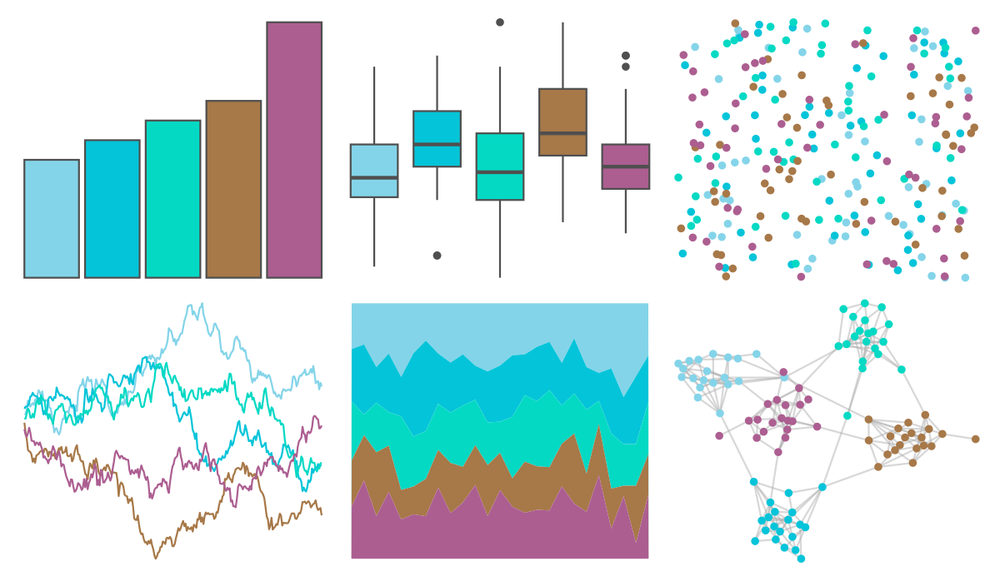

# fishualize - Thalassoma_noronhanum 

::: columns
::: {.column width="50%"}

**Github**

[nschiett/fishualize](https://github.com/nschiett/fishualize)
:::

::: {.column width="50%"}

**CRAN**

[fishualize](https://CRAN.R-project.org/package=fishualize)
:::
:::

<hr> 

Use with [paletteer](https://emilhvitfeldt.github.io/paletteer/) package:

```r
library(paletteer)
paletteer_d("fishualize::Thalassoma_noronhanum")
```

Use raw:

```r
c("#84D4E9FF", "#04C4D9FF", "#04D9C4FF", "#A77848FF", "#AC5E91FF")
``` 

 

<br>

# Related Palettes

<div class="list" style="display: grid; grid-template-columns: auto auto auto;"> <figure class="figure">
<a href="../../amerika/Dem_Ind_Rep3/"> </a>
</figure> <figure class="figure">
<a href="../../fishualize/Scarus_zelindae/"> </a>
</figure> <figure class="figure">
<a href="../../trekcolors/lcars_29c/"> </a>
</figure> <figure class="figure">
<a href="../../calecopal/figmtn/"> </a>
</figure> <figure class="figure">
<a href="../../NineteenEightyR/miami2/"> </a>
</figure> <figure class="figure">
<a href="../../vapeplot/mallsoft/"> </a>
</figure> <figure class="figure">
<a href="../../vapoRwave/mallSoft/"> </a>
</figure> <figure class="figure">
<a href="../../ltc/gaby/"> </a>
</figure> <figure class="figure">
<a href="../../tvthemes/Pearl/"> </a>
</figure> <figure class="figure">
<a href="../../MoMAColors/Lupi/"> </a>
</figure> <figure class="figure">
<a href="../../NatParksPalettes/Banff/"> </a>
</figure> <figure class="figure">
<a href="../../ggthemes/Nuriel_Stone/"> </a>
</figure> 
</div>
