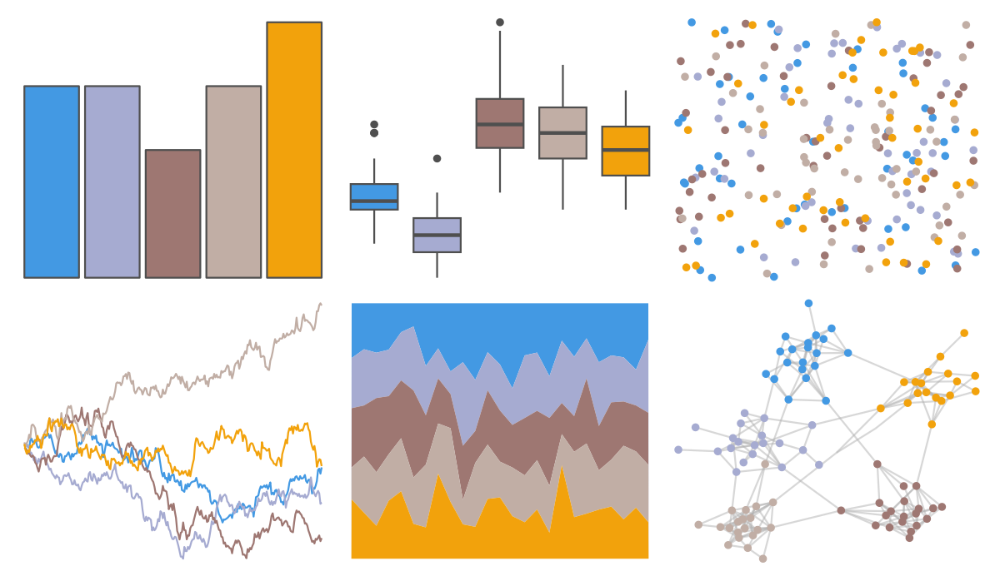
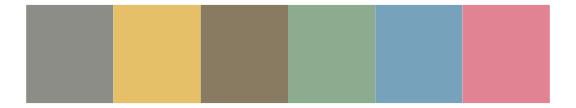
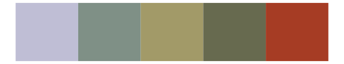

# fishualize - Xyrichthys_novacula 

::: columns
::: {.column width="50%"}

**Github**

[nschiett/fishualize](https://github.com/nschiett/fishualize)
:::

::: {.column width="50%"}

**CRAN**

[fishualize](https://CRAN.R-project.org/package=fishualize)
:::
:::

<hr> 

Use with [paletteer](https://emilhvitfeldt.github.io/paletteer/) package:

```r
library(paletteer)
paletteer_d("fishualize::Xyrichthys_novacula")
```

Use raw:

```r
c("#4399E3FF", "#A6ABD1FF", "#9E7772FF", "#C1AEA5FF", "#F2A20CFF")
``` 

 

<br>

# Related Palettes

<div class="list" style="display: grid; grid-template-columns: auto auto auto;"> <figure class="figure">
<a href="../../awtools/a_palette/"> </a>
</figure> <figure class="figure">
<a href="../../nord/aurora/"> </a>
</figure> <figure class="figure">
<a href="../../ggthemes/excel_Paper/"> </a>
</figure> <figure class="figure">
<a href="../../ggthemes/excel_Crop/"> </a>
</figure> <figure class="figure">
<a href="../../nationalparkcolors/Redwoods/"> </a>
</figure> <figure class="figure">
<a href="../../lisa/WinslowHomer/"> </a>
</figure> <figure class="figure">
<a href="../../lisa/JosefAlbers/"> </a>
</figure> <figure class="figure">
<a href="../../rockthemes/electric/"> </a>
</figure> <figure class="figure">
<a href="../../calecopal/dudleya/"> </a>
</figure> <figure class="figure">
<a href="../../calecopal/chaparral1/"> </a>
</figure> <figure class="figure">
<a href="../../lisa/PieterBruegel/"> </a>
</figure> <figure class="figure">
<a href="../../fishualize/Lutjanus_jocu/"> </a>
</figure> 
</div>
