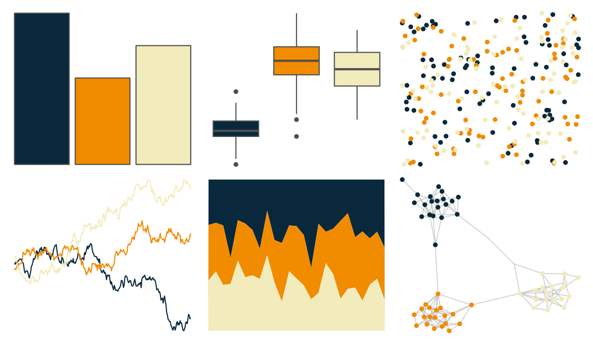
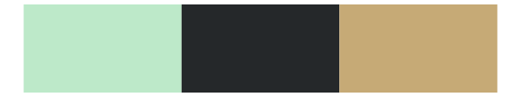

# futurevisions - atomic_orange 

::: columns
::: {.column width="50%"}

**Github**

[JoeyStanley/futurevisions](https://github.com/JoeyStanley/futurevisions)
:::

::: {.column width="50%"}

**CRAN**

Not on CRAN
:::
:::

<hr> 

Use with [paletteer](https://emilhvitfeldt.github.io/paletteer/) package:

```r
library(paletteer)
paletteer_d("futurevisions::atomic_orange")
```

Use raw:

```r
c("#09283CFF", "#F18B00FF", "#F2EBBBFF")
``` 

 

<br>

# Related Palettes

<div class="list" style="display: grid; grid-template-columns: auto auto auto;"> <figure class="figure">
<a href="../../awtools/a_palette/"> </a>
</figure> <figure class="figure">
<a href="../../futurevisions/atomic_red/"> </a>
</figure> <figure class="figure">
<a href="../../nbapalettes/pacers/"> </a>
</figure> <figure class="figure">
<a href="../../nbapalettes/celtics/"> </a>
</figure> <figure class="figure">
<a href="../../futurevisions/atomic_blue/"> </a>
</figure> <figure class="figure">
<a href="../../nbapalettes/jazz/"> </a>
</figure> <figure class="figure">
<a href="../../nbapalettes/warriors_cny/"> </a>
</figure> <figure class="figure">
<a href="../../unikn/pal_signal/"> </a>
</figure> <figure class="figure">
<a href="../../nbapalettes/warriors_city/"> </a>
</figure> <figure class="figure">
<a href="../../nbapalettes/hornets_city/"> </a>
</figure> <figure class="figure">
<a href="../../nbapalettes/hawks_statement/"> </a>
</figure> <figure class="figure">
<a href="../../nbapalettes/pelicans/"> </a>
</figure> 
</div>
