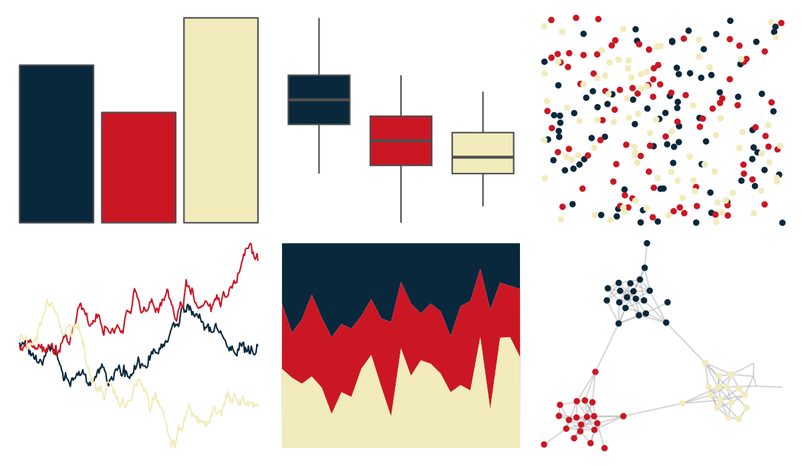

# futurevisions - atomic_red 

::: columns
::: {.column width="50%"}

**Github**

[JoeyStanley/futurevisions](https://github.com/JoeyStanley/futurevisions)
:::

::: {.column width="50%"}

**CRAN**

Not on CRAN
:::
:::

<hr> 

Use with [paletteer](https://emilhvitfeldt.github.io/paletteer/) package:

```r
library(paletteer)
paletteer_d("futurevisions::atomic_red")
```

Use raw:

```r
c("#09283CFF", "#CB1724FF", "#F2EBBBFF")
``` 

 

<br>

# Related Palettes

<div class="list" style="display: grid; grid-template-columns: auto auto auto;"> <figure class="figure">
<a href="../../amerika/Dem_Ind_Rep3/"> </a>
</figure> <figure class="figure">
<a href="../../khroma/highcontrast/"> </a>
</figure> <figure class="figure">
<a href="../../nbapalettes/warriors_cny/"> </a>
</figure> <figure class="figure">
<a href="../../nbapalettes/pelicans/"> </a>
</figure> <figure class="figure">
<a href="../../futurevisions/atomic_orange/"> </a>
</figure> <figure class="figure">
<a href="../../nbapalettes/hawks_statement/"> </a>
</figure> <figure class="figure">
<a href="../../nbapalettes/warriors_city/"> </a>
</figure> <figure class="figure">
<a href="../../nbapalettes/bulls_city/"> </a>
</figure> <figure class="figure">
<a href="../../nbapalettes/wizards_city/"> </a>
</figure> <figure class="figure">
<a href="../../nbapalettes/pacers/"> </a>
</figure> <figure class="figure">
<a href="../../nbapalettes/rockets_original/"> </a>
</figure> <figure class="figure">
<a href="../../ggthemes/wsj_red_green/"> </a>
</figure> 
</div>
