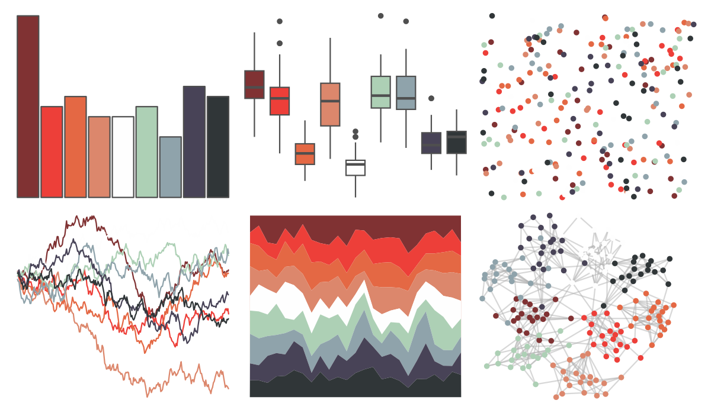

# futurevisions - kepler186 

::: columns
::: {.column width="50%"}

**Github**

[JoeyStanley/futurevisions](https://github.com/JoeyStanley/futurevisions)
:::

::: {.column width="50%"}

**CRAN**

Not on CRAN
:::
:::

<hr> 

Use with [paletteer](https://emilhvitfeldt.github.io/paletteer/) package:

```r
library(paletteer)
paletteer_d("futurevisions::kepler186")
```

Use raw:

```r
c("#803233FF", "#ED3F39FF", "#E46844FF", "#DC876CFF", "#FEFEFEFF", "#ADD0B5FF", "#8FA3ABFF", "#484357FF", "#303638FF")
``` 

 

<br>

# Related Palettes

<div class="list" style="display: grid; grid-template-columns: auto auto auto;"> <figure class="figure">
<a href="../../amerika/Dem_Ind_Rep3/"> </a>
</figure> <figure class="figure">
<a href="../../palettetown/mr_mime/"> </a>
</figure> <figure class="figure">
<a href="../../palettetown/gengar/"> </a>
</figure> <figure class="figure">
<a href="../../palettetown/snubbull/"> </a>
</figure> <figure class="figure">
<a href="../../palettetown/seaking/"> </a>
</figure> <figure class="figure">
<a href="../../palettetown/flaaffy/"> </a>
</figure> <figure class="figure">
<a href="../../Redmonder/dPBIRdGy/"> </a>
</figure> <figure class="figure">
<a href="../../palettetown/venonat/"> </a>
</figure> <figure class="figure">
<a href="../../ggsci/flattastic_flatui/"> </a>
</figure> <figure class="figure">
<a href="../../palettetown/nosepass/"> </a>
</figure> <figure class="figure">
<a href="../../palettetown/corsola/"> </a>
</figure> <figure class="figure">
<a href="../../palettetown/haunter/"> </a>
</figure> 
</div>
