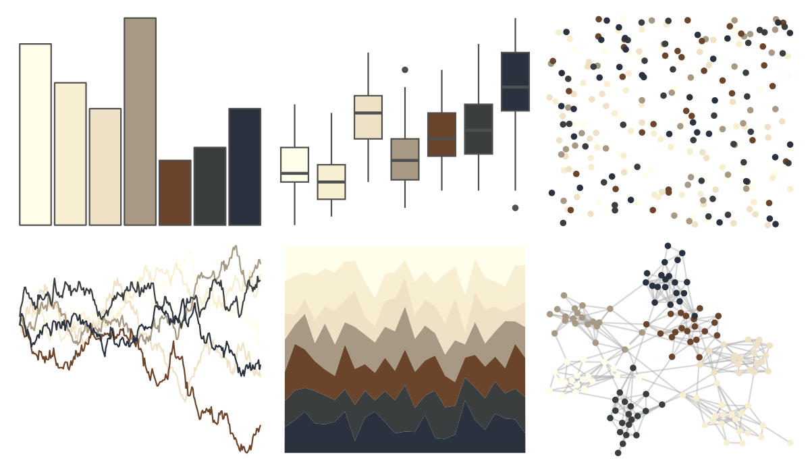

# ggpomological - pomological_base 

::: columns
::: {.column width="50%"}

**Github**

[gadenbuie/ggpomological](https://github.com/gadenbuie/ggpomological)
:::

::: {.column width="50%"}

**CRAN**

Not on CRAN
:::
:::

<hr> 

Use with [paletteer](https://emilhvitfeldt.github.io/paletteer/) package:

```r
library(paletteer)
paletteer_d("ggpomological::pomological_base")
```

Use raw:

```r
c("#FFFEEAFF", "#F8EED1FF", "#EFE1C6FF", "#A89985FF", "#6B452BFF", "#3A3E3FFF", "#2B323FFF")
``` 

 

<br>

# Related Palettes

<div class="list" style="display: grid; grid-template-columns: auto auto auto;"> <figure class="figure">
<a href="../../amerika/Dem_Ind_Rep3/"> </a>
</figure> <figure class="figure">
<a href="../../palettetown/elekid/"> </a>
</figure> <figure class="figure">
<a href="../../palettetown/heracross/"> </a>
</figure> <figure class="figure">
<a href="../../palettetown/hitmontop/"> </a>
</figure> <figure class="figure">
<a href="../../calecopal/caqu/"> </a>
</figure> <figure class="figure">
<a href="../../lisa/JohannesVermeer_1/"> </a>
</figure> <figure class="figure">
<a href="../../tayloRswift/speakNow/"> </a>
</figure> <figure class="figure">
<a href="../../nationalparkcolors/MtMckinley/"> </a>
</figure> <figure class="figure">
<a href="../../dutchmasters/milkmaid/"> </a>
</figure> <figure class="figure">
<a href="../../IslamicArt/jerusalem/"> </a>
</figure> <figure class="figure">
<a href="../../palettetown/horsea/"> </a>
</figure> <figure class="figure">
<a href="../../palettetown/furret/"> </a>
</figure> 
</div>
