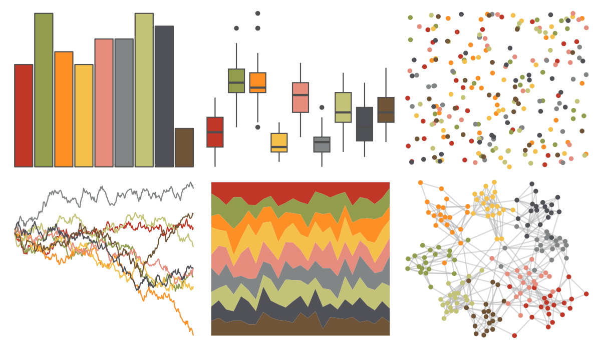
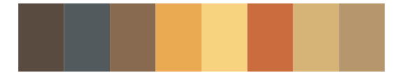

# ggpomological - pomological_palette 

::: columns
::: {.column width="50%"}

**Github**

[gadenbuie/ggpomological](https://github.com/gadenbuie/ggpomological)
:::

::: {.column width="50%"}

**CRAN**

Not on CRAN
:::
:::

<hr> 

Use with [paletteer](https://emilhvitfeldt.github.io/paletteer/) package:

```r
library(paletteer)
paletteer_d("ggpomological::pomological_palette")
```

Use raw:

```r
c("#C03728FF", "#919C4CFF", "#FD8F24FF", "#F5C04AFF", "#E68C7CFF", "#828585FF", "#C3C377FF", "#4F5157FF", "#6F5438FF")
``` 

 

<br>

# Related Palettes

<div class="list" style="display: grid; grid-template-columns: auto auto auto;"> <figure class="figure">
<a href="../../awtools/a_palette/"> </a>
</figure> <figure class="figure">
<a href="../../palettetown/baltoy/"> </a>
</figure> <figure class="figure">
<a href="../../Redmonder/qMSOMrq/"> </a>
</figure> <figure class="figure">
<a href="../../ggsci/light_uchicago/"> </a>
</figure> <figure class="figure">
<a href="../../IslamicArt/istanbul3/"> </a>
</figure> <figure class="figure">
<a href="../../palettetown/magcargo/"> </a>
</figure> <figure class="figure">
<a href="../../palettetown/solrock/"> </a>
</figure> <figure class="figure">
<a href="../../palettetown/delibird/"> </a>
</figure> <figure class="figure">
<a href="../../IslamicArt/cordoba/"> </a>
</figure> <figure class="figure">
<a href="../../palettetown/spinda/"> </a>
</figure> <figure class="figure">
<a href="../../palettetown/scizor/"> </a>
</figure> <figure class="figure">
<a href="../../palettetown/claydol/"> </a>
</figure> 
</div>
