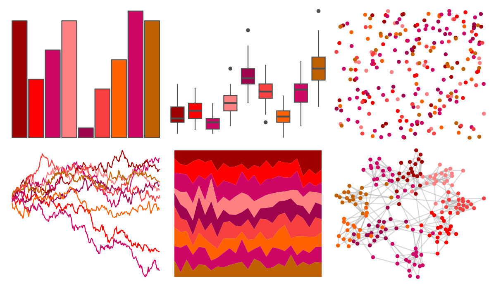
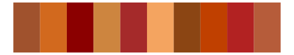

# ggprism - autumn_leaves 

::: columns
::: {.column width="50%"}

**Github**

[csdaw/ggprism](https://github.com/csdaw/ggprism)
:::

::: {.column width="50%"}

**CRAN**

[ggprism](https://CRAN.R-project.org/package=ggprism)
:::
:::

<hr> 

Use with [paletteer](https://emilhvitfeldt.github.io/paletteer/) package:

```r
library(paletteer)
paletteer_d("ggprism::autumn_leaves")
```

Use raw:

```r
c("#A00000FF", "#FF0000FF", "#CE0665FF", "#FF8080FF", "#9F044DFF", "#F94040FF", "#FF6000FF", "#CE0665FF", "#C06000FF")
``` 

 

<br>

# Related Palettes

<div class="list" style="display: grid; grid-template-columns: auto auto auto;"> <figure class="figure">
<a href="../../amerika/Dem_Ind_Rep3/"> </a>
</figure> <figure class="figure">
<a href="../../fishualize/Heretopriacanthus_cruentatus/"> </a>
</figure> <figure class="figure">
<a href="../../waRhol/camo_87_2/"> </a>
</figure> <figure class="figure">
<a href="../../fishualize/Acanthostracion_polygonius_y/"> </a>
</figure> <figure class="figure">
<a href="../../ggsci/red_material/"> </a>
</figure> <figure class="figure">
<a href="../../lisa/RupprechtGeiger/"> </a>
</figure> <figure class="figure">
<a href="../../miscpalettes/chocolate/"> </a>
</figure> <figure class="figure">
<a href="../../vapoRwave/sunSet/"> </a>
</figure> <figure class="figure">
<a href="../../lisa/JosefAlbers_1/"> </a>
</figure> <figure class="figure">
<a href="../../lisa/TerryFrost/"> </a>
</figure> <figure class="figure">
<a href="../../peRReo/natti/"> </a>
</figure> <figure class="figure">
<a href="../../vapeplot/sunset/"> </a>
</figure> 
</div>
