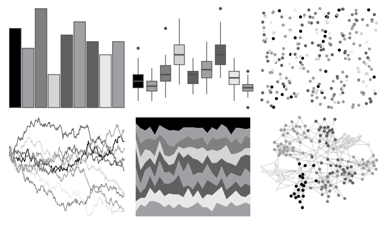

# ggprism - black_and_white 

::: columns
::: {.column width="50%"}

**Github**

[csdaw/ggprism](https://github.com/csdaw/ggprism)
:::

::: {.column width="50%"}

**CRAN**

[ggprism](https://CRAN.R-project.org/package=ggprism)
:::
:::

<hr> 

Use with [paletteer](https://emilhvitfeldt.github.io/paletteer/) package:

```r
library(paletteer)
paletteer_d("ggprism::black_and_white")
```

Use raw:

```r
c("#000000FF", "#A0A0A4FF", "#808080FF", "#D4D4D4FF", "#606060FF", "#A0A0A4FF", "#606060FF", "#E8E8E8FF", "#A0A0A4FF")
``` 

 

<br>

# Related Palettes

<div class="list" style="display: grid; grid-template-columns: auto auto auto;"> <figure class="figure">
<a href="../../awtools/a_palette/"> </a>
</figure> <figure class="figure">
<a href="../../trekcolors/borg/"> </a>
</figure> <figure class="figure">
<a href="../../ggsci/grey_material/"> </a>
</figure> <figure class="figure">
<a href="../../ggthemes/stata_mono/"> </a>
</figure> <figure class="figure">
<a href="../../palettetown/silcoon/"> </a>
</figure> <figure class="figure">
<a href="../../RColorBrewer/Greys/"> </a>
</figure> <figure class="figure">
<a href="../../Redmonder/sPBIGy1/"> </a>
</figure> <figure class="figure">
<a href="../../ggprism/shades_of_gray/"> </a>
</figure> <figure class="figure">
<a href="../../tayloRswift/reputation/"> </a>
</figure> <figure class="figure">
<a href="../../Redmonder/sPBIGy2/"> </a>
</figure> <figure class="figure">
<a href="../../awtools/gpalette/"> </a>
</figure> <figure class="figure">
<a href="../../miscpalettes/grayscale/"> </a>
</figure> 
</div>
