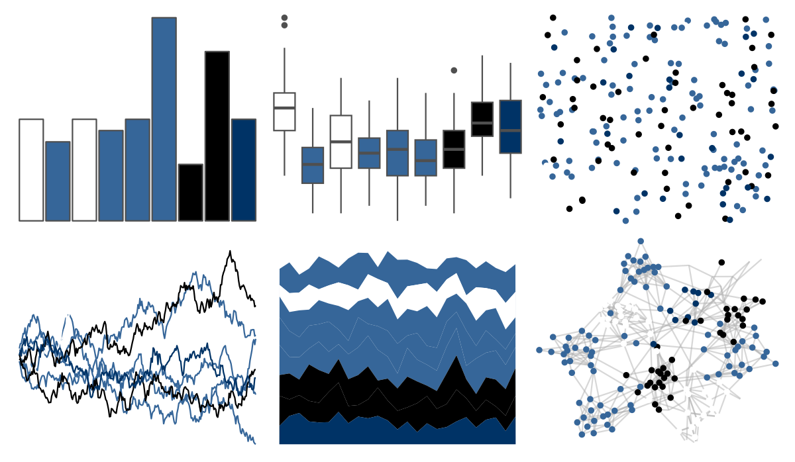

# ggprism - blueprint 

::: columns
::: {.column width="50%"}

**Github**

[csdaw/ggprism](https://github.com/csdaw/ggprism)
:::

::: {.column width="50%"}

**CRAN**

[ggprism](https://CRAN.R-project.org/package=ggprism)
:::
:::

<hr> 

Use with [paletteer](https://emilhvitfeldt.github.io/paletteer/) package:

```r
library(paletteer)
paletteer_d("ggprism::blueprint")
```

Use raw:

```r
c("#FFFFFFFF", "#366699FF", "#FFFFFFFF", "#366699FF", "#366699FF", "#366699FF", "#000000FF", "#000000FF", "#003366FF")
``` 

 

<br>

# Related Palettes

<div class="list" style="display: grid; grid-template-columns: auto auto auto;"> <figure class="figure">
<a href="../../awtools/a_palette/"> </a>
</figure> <figure class="figure">
<a href="../../ButterflyColors/hamadryas_feronia/"> </a>
</figure> <figure class="figure">
<a href="../../ButterflyColors/hamadryas_feronia/"> </a>
</figure> <figure class="figure">
<a href="../../ggprism/blueprint3/"> </a>
</figure> <figure class="figure">
<a href="../../nbapalettes/magic_city2/"> </a>
</figure> <figure class="figure">
<a href="../../palettetown/wailord/"> </a>
</figure> <figure class="figure">
<a href="../../tvthemes/Stark/"> </a>
</figure> <figure class="figure">
<a href="../../tvthemes/LapisLazuli/"> </a>
</figure> <figure class="figure">
<a href="../../tvthemes/Dark/"> </a>
</figure> <figure class="figure">
<a href="../../palettetown/altaria/"> </a>
</figure> <figure class="figure">
<a href="../../palettetown/barboach/"> </a>
</figure> <figure class="figure">
<a href="../../ggprism/fir/"> </a>
</figure> 
</div>
