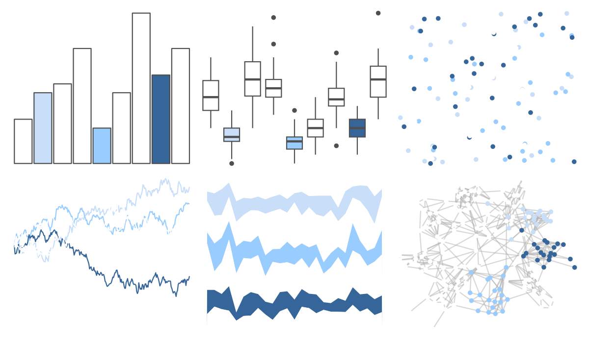

# ggprism - blueprint2 

::: columns
::: {.column width="50%"}

**Github**

[csdaw/ggprism](https://github.com/csdaw/ggprism)
:::

::: {.column width="50%"}

**CRAN**

[ggprism](https://CRAN.R-project.org/package=ggprism)
:::
:::

<hr> 

Use with [paletteer](https://emilhvitfeldt.github.io/paletteer/) package:

```r
library(paletteer)
paletteer_d("ggprism::blueprint2")
```

Use raw:

```r
c("#FFFFFFFF", "#C8DEF9FF", "#FFFFFFFF", "#FFFFFFFF", "#99CCFFFF", "#FFFFFFFF", "#FFFFFFFF", "#366699FF", "#FFFFFFFF")
``` 

 

<br>

# Related Palettes

<div class="list" style="display: grid; grid-template-columns: auto auto auto;"> <figure class="figure">
<a href="../../amerika/Dem_Ind_Rep3/"> </a>
</figure> <figure class="figure">
<a href="../../ggprism/diazo/"> </a>
</figure> <figure class="figure">
<a href="../../fishualize/Sardinella_brasiliensis/"> </a>
</figure> <figure class="figure">
<a href="../../PrettyCols/Winter/"> </a>
</figure> <figure class="figure">
<a href="../../ghibli/LaputaLight/"> </a>
</figure> <figure class="figure">
<a href="../../ghibli/SpiritedLight/"> </a>
</figure> <figure class="figure">
<a href="../../DresdenColor/colddays/"> </a>
</figure> <figure class="figure">
<a href="../../palettetown/dewgong/"> </a>
</figure> <figure class="figure">
<a href="../../ghibli/YesterdayLight/"> </a>
</figure> <figure class="figure">
<a href="../../nord/afternoon_prarie/"> </a>
</figure> <figure class="figure">
<a href="../../palettetown/kabutops/"> </a>
</figure> <figure class="figure">
<a href="../../ghibli/MarnieLight1/"> </a>
</figure> 
</div>
