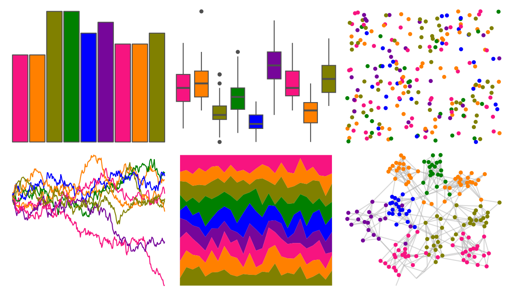

# ggprism - candy_bright 

::: columns
::: {.column width="50%"}

**Github**

[csdaw/ggprism](https://github.com/csdaw/ggprism)
:::

::: {.column width="50%"}

**CRAN**

[ggprism](https://CRAN.R-project.org/package=ggprism)
:::
:::

<hr> 

Use with [paletteer](https://emilhvitfeldt.github.io/paletteer/) package:

```r
library(paletteer)
paletteer_d("ggprism::candy_bright")
```

Use raw:

```r
c("#F71480FF", "#FF8000FF", "#808000FF", "#008000FF", "#0000FFFF", "#76069AFF", "#F71480FF", "#FF8000FF", "#808000FF")
``` 

 

<br>

# Related Palettes

<div class="list" style="display: grid; grid-template-columns: auto auto auto;"> <figure class="figure">
<a href="../../awtools/a_palette/"> </a>
</figure> <figure class="figure">
<a href="../../ButterflyColors/hamadryas_feronia/"> </a>
</figure> <figure class="figure">
<a href="../../ButterflyColors/hamadryas_feronia/"> </a>
</figure> <figure class="figure">
<a href="../../nbapalettes/nuggets_80s/"> </a>
</figure> <figure class="figure">
<a href="../../ggthemes/gdoc/"> </a>
</figure> <figure class="figure">
<a href="../../fishualize/Halichoeres_dimidiatus/"> </a>
</figure> <figure class="figure">
<a href="../../ggprism/spring/"> </a>
</figure> <figure class="figure">
<a href="../../trekcolors/enara/"> </a>
</figure> <figure class="figure">
<a href="../../ggprism/plasma/"> </a>
</figure> <figure class="figure">
<a href="../../ggthemes/excel_Slice/"> </a>
</figure> <figure class="figure">
<a href="../../MoMAColors/OKeeffe/"> </a>
</figure> <figure class="figure">
<a href="../../ggprism/candy_soft/"> </a>
</figure> 
</div>
