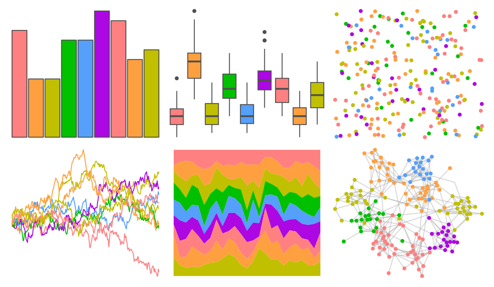
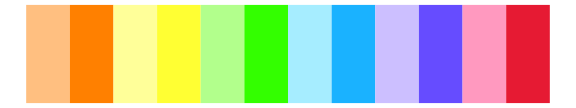
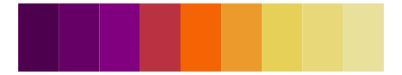

# ggprism - candy_soft 

::: columns
::: {.column width="50%"}

**Github**

[csdaw/ggprism](https://github.com/csdaw/ggprism)
:::

::: {.column width="50%"}

**CRAN**

[ggprism](https://CRAN.R-project.org/package=ggprism)
:::
:::

<hr> 

Use with [paletteer](https://emilhvitfeldt.github.io/paletteer/) package:

```r
library(paletteer)
paletteer_d("ggprism::candy_soft")
```

Use raw:

```r
c("#FF8080FF", "#FFA040FF", "#C0C000FF", "#00C000FF", "#55A0FBFF", "#AD07E3FF", "#FF8080FF", "#FFA040FF", "#C0C000FF")
``` 

 

<br>

# Related Palettes

<div class="list" style="display: grid; grid-template-columns: auto auto auto;"> <figure class="figure">
<a href="../../amerika/Dem_Ind_Rep3/"> </a>
</figure> <figure class="figure">
<a href="../../PrettyCols/Rainbow/"> </a>
</figure> <figure class="figure">
<a href="../../dichromat/Categorical_12/"> </a>
</figure> <figure class="figure">
<a href="../../colorBlindness/PairedColor12Steps/"> </a>
</figure> <figure class="figure">
<a href="../../ggprism/stained_glass2/"> </a>
</figure> <figure class="figure">
<a href="../../basetheme/deepblue/"> </a>
</figure> <figure class="figure">
<a href="../../trekcolors/enara/"> </a>
</figure> <figure class="figure">
<a href="../../LaCroixColoR/paired/"> </a>
</figure> <figure class="figure">
<a href="../../yarrr/southpark/"> </a>
</figure> <figure class="figure">
<a href="../../tidyquant/tq_dark/"> </a>
</figure> <figure class="figure">
<a href="../../colorBlindness/Blue2OrangeRed14Steps/"> </a>
</figure> <figure class="figure">
<a href="../../dichromat/BluetoOrangeRed_14/"> </a>
</figure> 
</div>
