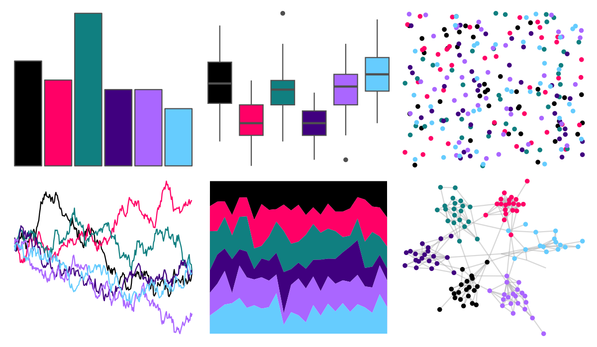

# ggprism - colorblind_safe 

::: columns
::: {.column width="50%"}

**Github**

[csdaw/ggprism](https://github.com/csdaw/ggprism)
:::

::: {.column width="50%"}

**CRAN**

[ggprism](https://CRAN.R-project.org/package=ggprism)
:::
:::

<hr> 

Use with [paletteer](https://emilhvitfeldt.github.io/paletteer/) package:

```r
library(paletteer)
paletteer_d("ggprism::colorblind_safe")
```

Use raw:

```r
c("#000000FF", "#FF0066FF", "#107F80FF", "#40007FFF", "#AA66FFFF", "#66CCFEFF")
``` 

 

<br>

# Related Palettes

<div class="list" style="display: grid; grid-template-columns: auto auto auto;"> <figure class="figure">
<a href="../../awtools/a_palette/"> </a>
</figure> <figure class="figure">
<a href="../../ButterflyColors/hamadryas_feronia/"> </a>
</figure> <figure class="figure">
<a href="../../ButterflyColors/hamadryas_feronia/"> </a>
</figure> <figure class="figure">
<a href="../../beyonce/X25/"> </a>
</figure> <figure class="figure">
<a href="../../suffrager/hanwell/"> </a>
</figure> <figure class="figure">
<a href="../../beyonce/X121/"> </a>
</figure> <figure class="figure">
<a href="../../nbapalettes/rockets_90s/"> </a>
</figure> <figure class="figure">
<a href="../../nbapalettes/pistons/"> </a>
</figure> <figure class="figure">
<a href="../../nbapalettes/pistons_city/"> </a>
</figure> <figure class="figure">
<a href="../../Manu/Kokako/"> </a>
</figure> <figure class="figure">
<a href="../../nbapalettes/timberwolves_statement/"> </a>
</figure> <figure class="figure">
<a href="../../nbapalettes/kings_city/"> </a>
</figure> 
</div>
