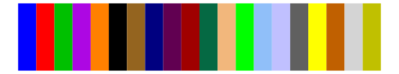
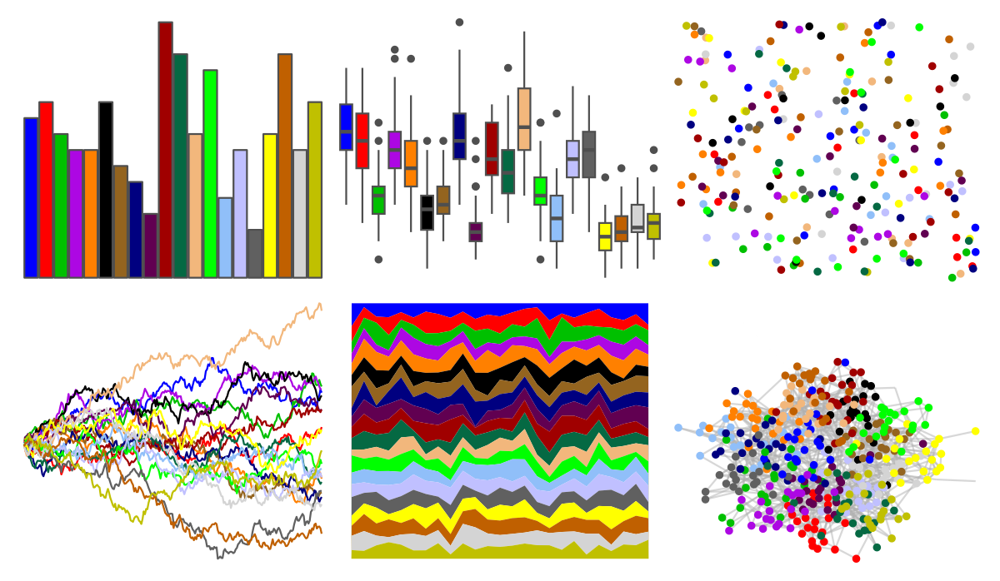
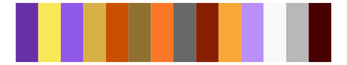

# ggprism - colors 

::: columns
::: {.column width="50%"}

**Github**

[csdaw/ggprism](https://github.com/csdaw/ggprism)
:::

::: {.column width="50%"}

**CRAN**

[ggprism](https://CRAN.R-project.org/package=ggprism)
:::
:::

<hr> 

Use with [paletteer](https://emilhvitfeldt.github.io/paletteer/) package:

```r
library(paletteer)
paletteer_d("ggprism::colors")
```

Use raw:

```r
c("#0000FFFF", "#FF0000FF", "#00C000FF", "#AD07E3FF", "#FF8000FF", "#000000FF", "#94641FFF", "#000080FF", "#610051FF", "#A00000FF", "#056943FF", "#F2B77CFF", "#00FF00FF", "#90BFF9FF", "#C0C0FFFF", "#606060FF", "#FFFF00FF", "#C06000FF", "#D4D4D4FF", "#C0C000FF")
``` 

 

<br>

# Related Palettes

<div class="list" style="display: grid; grid-template-columns: auto auto auto;"> <figure class="figure">
<a href="../../amerika/Dem_Ind_Rep3/"> </a>
</figure> <figure class="figure">
<a href="../../colorBlindness/paletteMartin/"> </a>
</figure> <figure class="figure">
<a href="../../palettesForR/Android/"> </a>
</figure> <figure class="figure">
<a href="../../ggthemes/stata_s1rcolor/"> </a>
</figure> <figure class="figure">
<a href="../../miscpalettes/bright/"> </a>
</figure> <figure class="figure">
<a href="../../awtools/bpalette/"> </a>
</figure> <figure class="figure">
<a href="../../tvthemes/gravityFalls/"> </a>
</figure> <figure class="figure">
<a href="../../pals/watlington/"> </a>
</figure> <figure class="figure">
<a href="../../tvthemes/kimPossible/"> </a>
</figure> <figure class="figure">
<a href="../../palettetown/jynx/"> </a>
</figure> <figure class="figure">
<a href="../../palettetown/ariados/"> </a>
</figure> <figure class="figure">
<a href="../../tidyquant/tq_green/"> </a>
</figure> 
</div>
