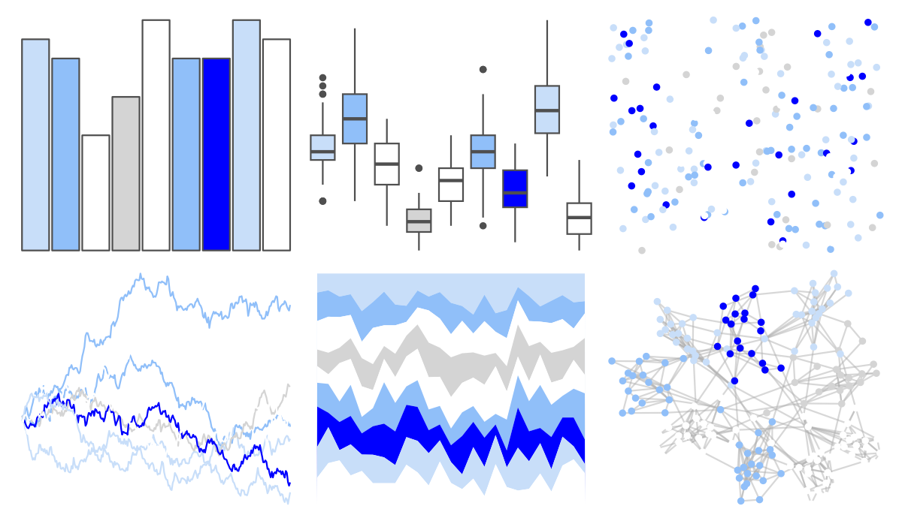
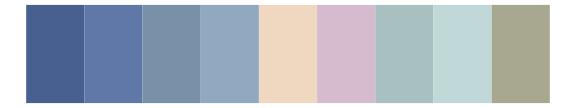
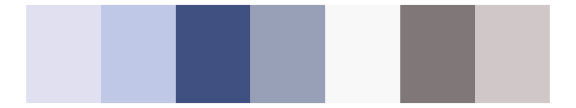

# ggprism - diazo 

::: columns
::: {.column width="50%"}

**Github**

[csdaw/ggprism](https://github.com/csdaw/ggprism)
:::

::: {.column width="50%"}

**CRAN**

[ggprism](https://CRAN.R-project.org/package=ggprism)
:::
:::

<hr> 

Use with [paletteer](https://emilhvitfeldt.github.io/paletteer/) package:

```r
library(paletteer)
paletteer_d("ggprism::diazo")
```

Use raw:

```r
c("#C8DEF9FF", "#90BFF9FF", "#FFFFFFFF", "#D4D4D4FF", "#FFFFFFFF", "#90BFF9FF", "#0000FFFF", "#C8DEF9FF", "#FFFFFFFF")
``` 

 

<br>

# Related Palettes

<div class="list" style="display: grid; grid-template-columns: auto auto auto;"> <figure class="figure">
<a href="../../awtools/a_palette/"> </a>
</figure> <figure class="figure">
<a href="../../ggprism/blueprint2/"> </a>
</figure> <figure class="figure">
<a href="../../palettetown/lugia/"> </a>
</figure> <figure class="figure">
<a href="../../palettetown/venomoth/"> </a>
</figure> <figure class="figure">
<a href="../../DresdenColor/colddays/"> </a>
</figure> <figure class="figure">
<a href="../../nord/afternoon_prarie/"> </a>
</figure> <figure class="figure">
<a href="../../palettetown/hitmontop/"> </a>
</figure> <figure class="figure">
<a href="../../palettetown/pupitar/"> </a>
</figure> <figure class="figure">
<a href="../../palettetown/dewgong/"> </a>
</figure> <figure class="figure">
<a href="../../Redmonder/dPBIRdBu/"> </a>
</figure> <figure class="figure">
<a href="../../palettetown/tyranitar/"> </a>
</figure> <figure class="figure">
<a href="../../palettetown/mewtwo/"> </a>
</figure> 
</div>
