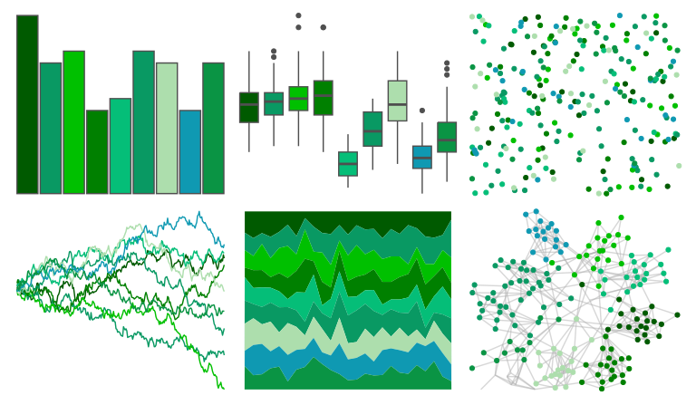

# ggprism - evergreen 

::: columns
::: {.column width="50%"}

**Github**

[csdaw/ggprism](https://github.com/csdaw/ggprism)
:::

::: {.column width="50%"}

**CRAN**

[ggprism](https://CRAN.R-project.org/package=ggprism)
:::
:::

<hr> 

Use with [paletteer](https://emilhvitfeldt.github.io/paletteer/) package:

```r
library(paletteer)
paletteer_d("ggprism::evergreen")
```

Use raw:

```r
c("#005A00FF", "#099963FF", "#00C000FF", "#008000FF", "#05BE78FF", "#099963FF", "#ADDEADFF", "#0F99B2FF", "#0A9444FF")
``` 

 

<br>

# Related Palettes

<div class="list" style="display: grid; grid-template-columns: auto auto auto;"> <figure class="figure">
<a href="../../awtools/a_palette/"> </a>
</figure> <figure class="figure">
<a href="../../ggthemes/excel_Green/"> </a>
</figure> <figure class="figure">
<a href="../../ggthemes/excel_Green_Yellow/"> </a>
</figure> <figure class="figure">
<a href="../../RColorBrewer/YlGn/"> </a>
</figure> <figure class="figure">
<a href="../../RColorBrewer/Greens/"> </a>
</figure> <figure class="figure">
<a href="../../Redmonder/qMSOGn/"> </a>
</figure> <figure class="figure">
<a href="../../ggthemes/excel_Blue/"> </a>
</figure> <figure class="figure">
<a href="../../Redmonder/qMSOGnYl/"> </a>
</figure> <figure class="figure">
<a href="../../fishualize/Parablennius_pilicornis/"> </a>
</figure> <figure class="figure">
<a href="../../rcartocolor/TealGrn/"> </a>
</figure> <figure class="figure">
<a href="../../rcartocolor/ag_GrnYl/"> </a>
</figure> <figure class="figure">
<a href="../../LaCroixColoR/Lime/"> </a>
</figure> 
</div>
