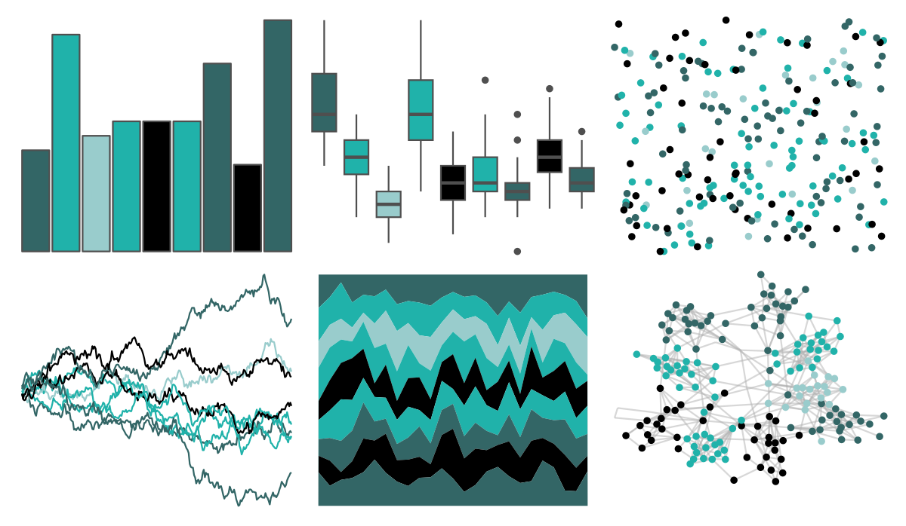
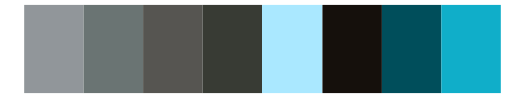

# ggprism - fir 

::: columns
::: {.column width="50%"}

**Github**

[csdaw/ggprism](https://github.com/csdaw/ggprism)
:::

::: {.column width="50%"}

**CRAN**

[ggprism](https://CRAN.R-project.org/package=ggprism)
:::
:::

<hr> 

Use with [paletteer](https://emilhvitfeldt.github.io/paletteer/) package:

```r
library(paletteer)
paletteer_d("ggprism::fir")
```

Use raw:

```r
c("#336666FF", "#20B2AAFF", "#99CCCCFF", "#20B2AAFF", "#000000FF", "#20B2AAFF", "#336666FF", "#000000FF", "#336666FF")
``` 

 

<br>

# Related Palettes

<div class="list" style="display: grid; grid-template-columns: auto auto auto;"> <figure class="figure">
<a href="../../awtools/a_palette/"> </a>
</figure> <figure class="figure">
<a href="../../ggprism/fir3/"> </a>
</figure> <figure class="figure">
<a href="../../ggprism/fir2/"> </a>
</figure> <figure class="figure">
<a href="../../ggprism/blueprint/"> </a>
</figure> <figure class="figure">
<a href="../../palettetown/quagsire/"> </a>
</figure> <figure class="figure">
<a href="../../ggprism/blueprint3/"> </a>
</figure> <figure class="figure">
<a href="../../miscpalettes/waterfall/"> </a>
</figure> <figure class="figure">
<a href="../../calecopal/sage/"> </a>
</figure> <figure class="figure">
<a href="../../tvthemes/LapisLazuli/"> </a>
</figure> <figure class="figure">
<a href="../../MetBrewer/Pissaro/"> </a>
</figure> <figure class="figure">
<a href="../../palettetown/wynaut/"> </a>
</figure> <figure class="figure">
<a href="../../Redmonder/qMSOBuGn/"> </a>
</figure> 
</div>
