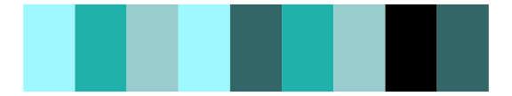

# ggprism - fir2 

::: columns
::: {.column width="50%"}

**Github**

[csdaw/ggprism](https://github.com/csdaw/ggprism)
:::

::: {.column width="50%"}

**CRAN**

[ggprism](https://CRAN.R-project.org/package=ggprism)
:::
:::

<hr> 

Use with [paletteer](https://emilhvitfeldt.github.io/paletteer/) package:

```r
library(paletteer)
paletteer_d("ggprism::fir2")
```

Use raw:

```r
c("#9DF8FFFF", "#20B2AAFF", "#99CCCCFF", "#9DF8FFFF", "#336666FF", "#20B2AAFF", "#99CCCCFF", "#000000FF", "#336666FF")
``` 

 

<br>

# Related Palettes

<div class="list" style="display: grid; grid-template-columns: auto auto auto;"> <figure class="figure">
<a href="../../awtools/a_palette/"> </a>
</figure> <figure class="figure">
<a href="../../ggprism/fir3/"> </a>
</figure> <figure class="figure">
<a href="../../ggprism/fir/"> </a>
</figure> <figure class="figure">
<a href="../../unikn/pal_unikn/"> </a>
</figure> <figure class="figure">
<a href="../../unikn/pal_unikn_web/"> </a>
</figure> <figure class="figure">
<a href="../../unikn/pal_unikn_ppt/"> </a>
</figure> <figure class="figure">
<a href="../../palettetown/swablu/"> </a>
</figure> <figure class="figure">
<a href="../../dichromat/BluetoGray_8/"> </a>
</figure> <figure class="figure">
<a href="../../colorBlindness/Blue2Gray8Steps/"> </a>
</figure> <figure class="figure">
<a href="../../tvthemes/Stark/"> </a>
</figure> <figure class="figure">
<a href="../../calecopal/lake/"> </a>
</figure> <figure class="figure">
<a href="../../ggprism/blueprint3/"> </a>
</figure> 
</div>
