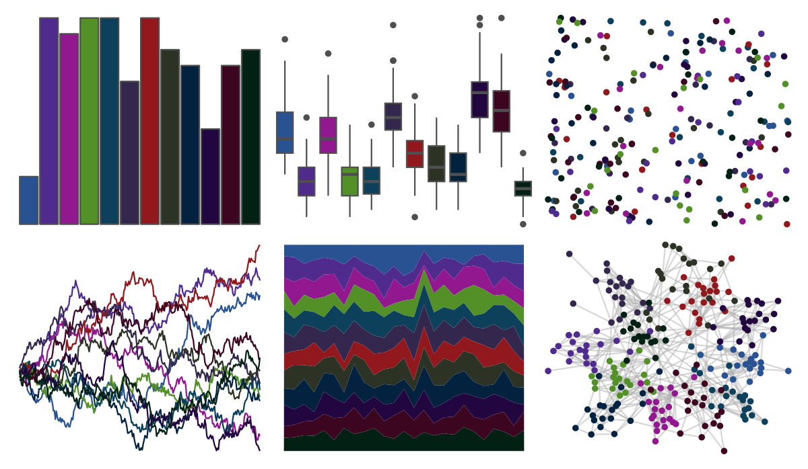

# ggprism - floral 

::: columns
::: {.column width="50%"}

**Github**

[csdaw/ggprism](https://github.com/csdaw/ggprism)
:::

::: {.column width="50%"}

**CRAN**

[ggprism](https://CRAN.R-project.org/package=ggprism)
:::
:::

<hr> 

Use with [paletteer](https://emilhvitfeldt.github.io/paletteer/) package:

```r
library(paletteer)
paletteer_d("ggprism::floral")
```

Use raw:

```r
c("#285291FF", "#4F2B8EFF", "#91188EFF", "#539027FF", "#0D405BFF", "#34274DFF", "#91181DFF", "#2C3324FF", "#022240FF", "#21063FFF", "#3D0620FF", "#022013FF")
``` 

 

<br>

# Related Palettes

<div class="list" style="display: grid; grid-template-columns: auto auto auto;"> <figure class="figure">
<a href="../../awtools/a_palette/"> </a>
</figure> <figure class="figure">
<a href="../../ggprism/summer/"> </a>
</figure> <figure class="figure">
<a href="../../peRReo/eminem/"> </a>
</figure> <figure class="figure">
<a href="../../ggsci/default_aaas/"> </a>
</figure> <figure class="figure">
<a href="../../nbapalettes/mavericks_alt/"> </a>
</figure> <figure class="figure">
<a href="../../nbapalettes/sixers/"> </a>
</figure> <figure class="figure">
<a href="../../nbapalettes/mavericks/"> </a>
</figure> <figure class="figure">
<a href="../../feathers/cassowary/"> </a>
</figure> <figure class="figure">
<a href="../../palettesForR/Cool/"> </a>
</figure> <figure class="figure">
<a href="../../nbapalettes/kings_alt/"> </a>
</figure> <figure class="figure">
<a href="../../trekcolors/starfleet2/"> </a>
</figure> <figure class="figure">
<a href="../../tvthemes/Dark/"> </a>
</figure> 
</div>
