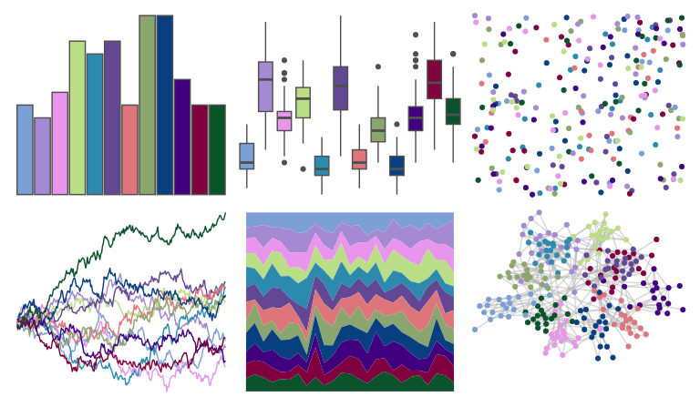

# ggprism - floral2 

::: columns
::: {.column width="50%"}

**Github**

[csdaw/ggprism](https://github.com/csdaw/ggprism)
:::

::: {.column width="50%"}

**CRAN**

[ggprism](https://CRAN.R-project.org/package=ggprism)
:::
:::

<hr> 

Use with [paletteer](https://emilhvitfeldt.github.io/paletteer/) package:

```r
library(paletteer)
paletteer_d("ggprism::floral2")
```

Use raw:

```r
c("#7CA0D4FF", "#A48AD3FF", "#E995EBFF", "#BADE86FF", "#2B8AAEFF", "#624894FF", "#DE757BFF", "#8BA56FFF", "#073F80FF", "#40007FFF", "#80003FFF", "#0A522AFF")
``` 

 

<br>

# Related Palettes

<div class="list" style="display: grid; grid-template-columns: auto auto auto;"> <figure class="figure">
<a href="../../awtools/a_palette/"> </a>
</figure> <figure class="figure">
<a href="../../rcartocolor/Safe/"> </a>
</figure> <figure class="figure">
<a href="../../ggsci/lanonc_lancet/"> </a>
</figure> <figure class="figure">
<a href="../../tvthemes/CrystalGems/"> </a>
</figure> <figure class="figure">
<a href="../../peRReo/ozuna/"> </a>
</figure> <figure class="figure">
<a href="../../tvthemes/Bismuth/"> </a>
</figure> <figure class="figure">
<a href="../../unikn/pal_unikn_pref/"> </a>
</figure> <figure class="figure">
<a href="../../peRReo/karolg/"> </a>
</figure> <figure class="figure">
<a href="../../khroma/muted/"> </a>
</figure> <figure class="figure">
<a href="../../jcolors/pal8/"> </a>
</figure> <figure class="figure">
<a href="../../tvthemes/gravityFalls/"> </a>
</figure> <figure class="figure">
<a href="../../tvthemes/Garnet/"> </a>
</figure> 
</div>
