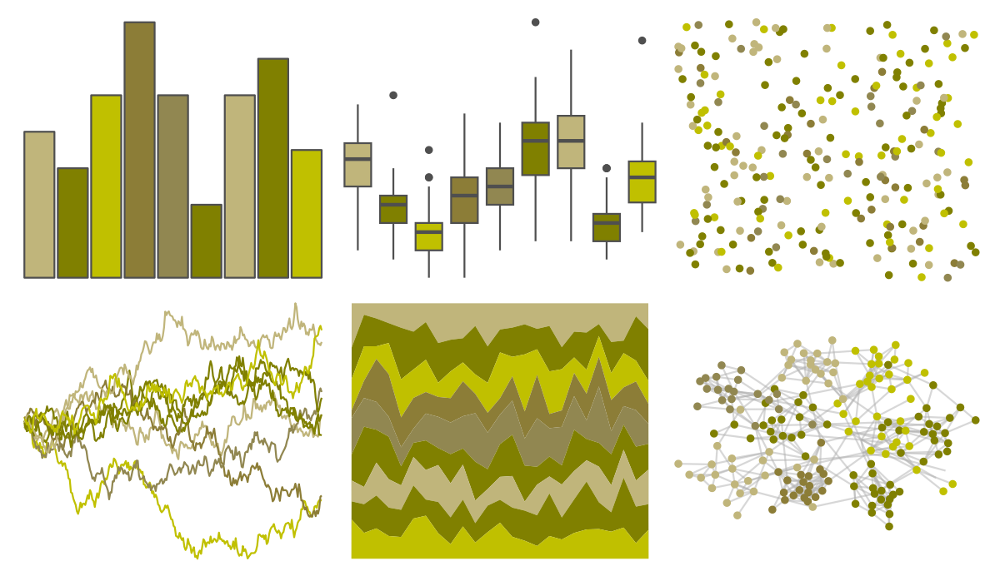

# ggprism - mustard_field 

::: columns
::: {.column width="50%"}

**Github**

[csdaw/ggprism](https://github.com/csdaw/ggprism)
:::

::: {.column width="50%"}

**CRAN**

[ggprism](https://CRAN.R-project.org/package=ggprism)
:::
:::

<hr> 

Use with [paletteer](https://emilhvitfeldt.github.io/paletteer/) package:

```r
library(paletteer)
paletteer_d("ggprism::mustard_field")
```

Use raw:

```r
c("#C0B57BFF", "#808000FF", "#C0C000FF", "#8C7D37FF", "#918751FF", "#808000FF", "#C0B57BFF", "#808000FF", "#C0C000FF")
``` 

 

<br>

# Related Palettes

<div class="list" style="display: grid; grid-template-columns: auto auto auto;"> <figure class="figure">
<a href="../../awtools/a_palette/"> </a>
</figure> <figure class="figure">
<a href="../../ButterflyColors/hamadryas_feronia/"> </a>
</figure> <figure class="figure">
<a href="../../ButterflyColors/hamadryas_feronia/"> </a>
</figure> <figure class="figure">
<a href="../../ggprism/mustard_field2/"> </a>
</figure> <figure class="figure">
<a href="../../fishualize/Gymnothorax_funebris/"> </a>
</figure> <figure class="figure">
<a href="../../palettetown/abra/"> </a>
</figure> <figure class="figure">
<a href="../../fishualize/Prognathodes_brasiliensis/"> </a>
</figure> <figure class="figure">
<a href="../../palettetown/cacturne/"> </a>
</figure> <figure class="figure">
<a href="../../Redmonder/sPBIYl/"> </a>
</figure> <figure class="figure">
<a href="../../ggsci/lime_material/"> </a>
</figure> <figure class="figure">
<a href="../../Manu/Kakapo/"> </a>
</figure> <figure class="figure">
<a href="../../colRoz/c_kingii/"> </a>
</figure> 
</div>
