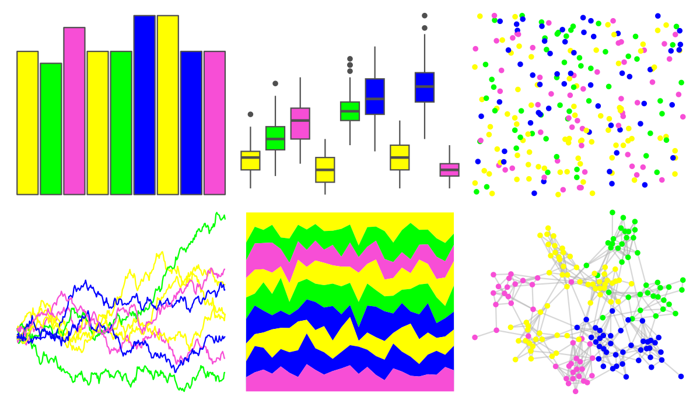

# ggprism - neon 

::: columns
::: {.column width="50%"}

**Github**

[csdaw/ggprism](https://github.com/csdaw/ggprism)
:::

::: {.column width="50%"}

**CRAN**

[ggprism](https://CRAN.R-project.org/package=ggprism)
:::
:::

<hr> 

Use with [paletteer](https://emilhvitfeldt.github.io/paletteer/) package:

```r
library(paletteer)
paletteer_d("ggprism::neon")
```

Use raw:

```r
c("#FFFF00FF", "#00FF00FF", "#F74ED6FF", "#FFFF00FF", "#00FF00FF", "#0000FFFF", "#FFFF00FF", "#0000FFFF", "#F74ED6FF")
``` 

 

<br>

# Related Palettes

<div class="list" style="display: grid; grid-template-columns: auto auto auto;"> <figure class="figure">
<a href="../../awtools/a_palette/"> </a>
</figure> <figure class="figure">
<a href="../../ButterflyColors/hamadryas_feronia/"> </a>
</figure> <figure class="figure">
<a href="../../ButterflyColors/hamadryas_feronia/"> </a>
</figure> <figure class="figure">
<a href="../../colorBlindness/Blue2Green14Steps/"> </a>
</figure> <figure class="figure">
<a href="../../dichromat/BluetoGreen_14/"> </a>
</figure> <figure class="figure">
<a href="../../fishualize/Coryphaena_hippurus/"> </a>
</figure> <figure class="figure">
<a href="../../trekcolors/lcars_23c/"> </a>
</figure> <figure class="figure">
<a href="../../ggprism/stained_glass2/"> </a>
</figure> <figure class="figure">
<a href="../../ggprism/candy_soft/"> </a>
</figure> <figure class="figure">
<a href="../../jcolors/pal3/"> </a>
</figure> <figure class="figure">
<a href="../../ggprism/stained_glass/"> </a>
</figure> <figure class="figure">
<a href="../../fishualize/Gomphosus_varius/"> </a>
</figure> 
</div>
