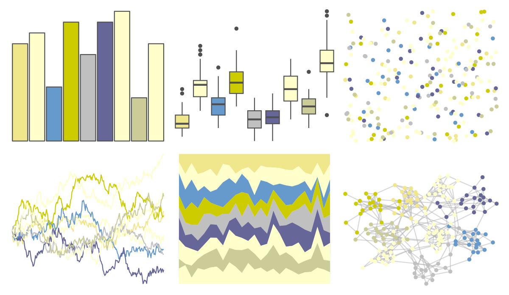
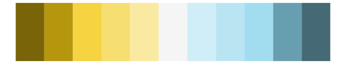
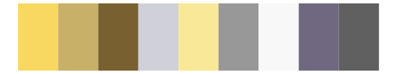

# ggprism - ocean2 

::: columns
::: {.column width="50%"}

**Github**

[csdaw/ggprism](https://github.com/csdaw/ggprism)
:::

::: {.column width="50%"}

**CRAN**

[ggprism](https://CRAN.R-project.org/package=ggprism)
:::
:::

<hr> 

Use with [paletteer](https://emilhvitfeldt.github.io/paletteer/) package:

```r
library(paletteer)
paletteer_d("ggprism::ocean2")
```

Use raw:

```r
c("#F0E68CFF", "#FFFFCCFF", "#6699CCFF", "#CCCC00FF", "#C0C0C0FF", "#666699FF", "#FFFFCCFF", "#CCCC99FF", "#FFFFCCFF")
``` 

 

<br>

# Related Palettes

<div class="list" style="display: grid; grid-template-columns: auto auto auto;"> <figure class="figure">
<a href="../../awtools/a_palette/"> </a>
</figure> <figure class="figure">
<a href="../../Redmonder/dPBIYlBu/"> </a>
</figure> <figure class="figure">
<a href="../../ggprism/ocean/"> </a>
</figure> <figure class="figure">
<a href="../../ggprism/ocean3/"> </a>
</figure> <figure class="figure">
<a href="../../palettetown/sandshrew/"> </a>
</figure> <figure class="figure">
<a href="../../palettetown/teddiursa/"> </a>
</figure> <figure class="figure">
<a href="../../palettetown/hypno/"> </a>
</figure> <figure class="figure">
<a href="../../palettetown/scyther/"> </a>
</figure> <figure class="figure">
<a href="../../ggprism/quiet2/"> </a>
</figure> <figure class="figure">
<a href="../../palettetown/celebi/"> </a>
</figure> <figure class="figure">
<a href="../../palettetown/dragonite/"> </a>
</figure> <figure class="figure">
<a href="../../palettetown/omanyte/"> </a>
</figure> 
</div>
