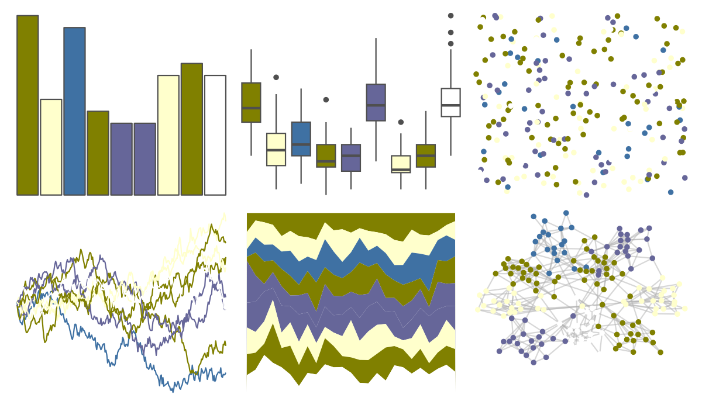
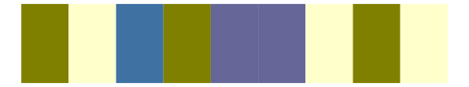
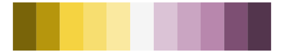

# ggprism - ocean3 

::: columns
::: {.column width="50%"}

**Github**

[csdaw/ggprism](https://github.com/csdaw/ggprism)
:::

::: {.column width="50%"}

**CRAN**

[ggprism](https://CRAN.R-project.org/package=ggprism)
:::
:::

<hr> 

Use with [paletteer](https://emilhvitfeldt.github.io/paletteer/) package:

```r
library(paletteer)
paletteer_d("ggprism::ocean3")
```

Use raw:

```r
c("#808000FF", "#FFFFCCFF", "#3F71A3FF", "#808000FF", "#666699FF", "#666699FF", "#FFFFCCFF", "#808000FF", "#FFFFFFFF")
``` 

 

<br>

# Related Palettes

<div class="list" style="display: grid; grid-template-columns: auto auto auto;"> <figure class="figure">
<a href="../../amerika/Dem_Ind_Rep3/"> </a>
</figure> <figure class="figure">
<a href="../../ggprism/ocean/"> </a>
</figure> <figure class="figure">
<a href="../../palettetown/tauros/"> </a>
</figure> <figure class="figure">
<a href="../../palettetown/hitmontop/"> </a>
</figure> <figure class="figure">
<a href="../../Redmonder/dPBIYlBu/"> </a>
</figure> <figure class="figure">
<a href="../../Redmonder/dPBIYlPu/"> </a>
</figure> <figure class="figure">
<a href="../../ggprism/ocean2/"> </a>
</figure> <figure class="figure">
<a href="../../ggpomological/pomological_base/"> </a>
</figure> <figure class="figure">
<a href="../../palettetown/omanyte/"> </a>
</figure> <figure class="figure">
<a href="../../palettetown/tyranitar/"> </a>
</figure> <figure class="figure">
<a href="../../palettetown/celebi/"> </a>
</figure> <figure class="figure">
<a href="../../palettetown/jolteon/"> </a>
</figure> 
</div>
