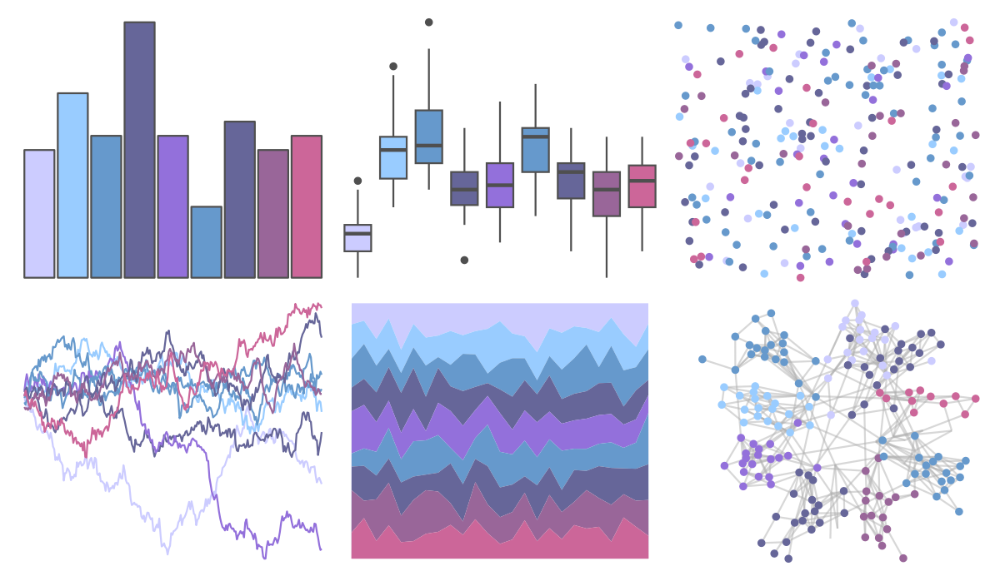

# ggprism - pastels 

::: columns
::: {.column width="50%"}

**Github**

[csdaw/ggprism](https://github.com/csdaw/ggprism)
:::

::: {.column width="50%"}

**CRAN**

[ggprism](https://CRAN.R-project.org/package=ggprism)
:::
:::

<hr> 

Use with [paletteer](https://emilhvitfeldt.github.io/paletteer/) package:

```r
library(paletteer)
paletteer_d("ggprism::pastels")
```

Use raw:

```r
c("#CCCCFFFF", "#99CCFFFF", "#6699CCFF", "#666699FF", "#9370DBFF", "#6699CCFF", "#666699FF", "#996699FF", "#CC6699FF")
``` 

 

<br>

# Related Palettes

<div class="list" style="display: grid; grid-template-columns: auto auto auto;"> <figure class="figure">
<a href="../../awtools/a_palette/"> </a>
</figure> <figure class="figure">
<a href="../../Redmonder/qMSOBuWarm/"> </a>
</figure> <figure class="figure">
<a href="../../rcartocolor/Purp/"> </a>
</figure> <figure class="figure">
<a href="../../ggthemes/excel_Gallery/"> </a>
</figure> <figure class="figure">
<a href="../../beyonce/X108/"> </a>
</figure> <figure class="figure">
<a href="../../Redmonder/qMSOPu2/"> </a>
</figure> <figure class="figure">
<a href="../../feathers/galah/"> </a>
</figure> <figure class="figure">
<a href="../../beyonce/X51/"> </a>
</figure> <figure class="figure">
<a href="../../palettetown/mewtwo/"> </a>
</figure> <figure class="figure">
<a href="../../Redmonder/qMSORdPu/"> </a>
</figure> <figure class="figure">
<a href="../../ggthemes/excel_Blue_Warm/"> </a>
</figure> <figure class="figure">
<a href="../../ggthemes/Purple_Pink_Gray/"> </a>
</figure> 
</div>
