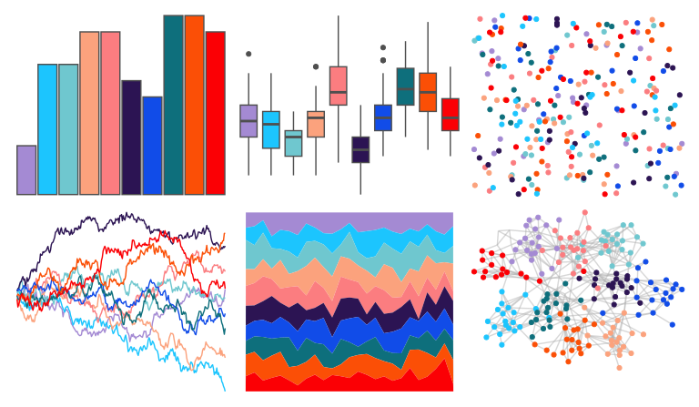

# ggprism - prism_dark 

::: columns
::: {.column width="50%"}

**Github**

[csdaw/ggprism](https://github.com/csdaw/ggprism)
:::

::: {.column width="50%"}

**CRAN**

[ggprism](https://CRAN.R-project.org/package=ggprism)
:::
:::

<hr> 

Use with [paletteer](https://emilhvitfeldt.github.io/paletteer/) package:

```r
library(paletteer)
paletteer_d("ggprism::prism_dark")
```

Use raw:

```r
c("#A48AD3FF", "#1CC5FEFF", "#6FC7CFFF", "#FBA27DFF", "#FB7D80FF", "#2C1453FF", "#114CE8FF", "#0E6F7CFF", "#FB4F06FF", "#FB0005FF")
``` 

 

<br>

# Related Palettes

<div class="list" style="display: grid; grid-template-columns: auto auto auto;"> <figure class="figure">
<a href="../../awtools/a_palette/"> </a>
</figure> <figure class="figure">
<a href="../../ggprism/prism_light2/"> </a>
</figure> <figure class="figure">
<a href="../../ggprism/prism_light/"> </a>
</figure> <figure class="figure">
<a href="../../ggprism/prism_dark2/"> </a>
</figure> <figure class="figure">
<a href="../../vapoRwave/hotlineBling/"> </a>
</figure> <figure class="figure">
<a href="../../ggthemr/solarized/"> </a>
</figure> <figure class="figure">
<a href="../../peRReo/badbunny1/"> </a>
</figure> <figure class="figure">
<a href="../../LaCroixColoR/CranRaspberry/"> </a>
</figure> <figure class="figure">
<a href="../../peRReo/karolg/"> </a>
</figure> <figure class="figure">
<a href="../../ggsci/nrc_npg/"> </a>
</figure> <figure class="figure">
<a href="../../tvthemes/Steven/"> </a>
</figure> <figure class="figure">
<a href="../../MetBrewer/Nizami/"> </a>
</figure> 
</div>
