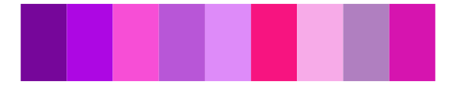
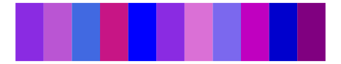

# ggprism - purple_passion 

::: columns
::: {.column width="50%"}

**Github**

[csdaw/ggprism](https://github.com/csdaw/ggprism)
:::

::: {.column width="50%"}

**CRAN**

[ggprism](https://CRAN.R-project.org/package=ggprism)
:::
:::

<hr> 

Use with [paletteer](https://emilhvitfeldt.github.io/paletteer/) package:

```r
library(paletteer)
paletteer_d("ggprism::purple_passion")
```

Use raw:

```r
c("#76069AFF", "#AD07E3FF", "#F74ED6FF", "#B856D7FF", "#DE8BF9FF", "#F71480FF", "#F7ABE8FF", "#B07FC0FF", "#D614AFFF")
``` 

 

<br>

# Related Palettes

<div class="list" style="display: grid; grid-template-columns: auto auto auto;"> <figure class="figure">
<a href="../../awtools/a_palette/"> </a>
</figure> <figure class="figure">
<a href="../../miscpalettes/berry/"> </a>
</figure> <figure class="figure">
<a href="../../ggthemes/excel_Red_Violet/"> </a>
</figure> <figure class="figure">
<a href="../../beyonce/X27/"> </a>
</figure> <figure class="figure">
<a href="../../NineteenEightyR/hotpink/"> </a>
</figure> <figure class="figure">
<a href="../../ggsci/purple_material/"> </a>
</figure> <figure class="figure">
<a href="../../ggthemes/excel_Violet_II/"> </a>
</figure> <figure class="figure">
<a href="../../vapoRwave/sunSet/"> </a>
</figure> <figure class="figure">
<a href="../../rcartocolor/Magenta/"> </a>
</figure> <figure class="figure">
<a href="../../vapeplot/sunset/"> </a>
</figure> <figure class="figure">
<a href="../../palettetown/ditto/"> </a>
</figure> <figure class="figure">
<a href="../../ggthemes/excel_Gallery/"> </a>
</figure> 
</div>
