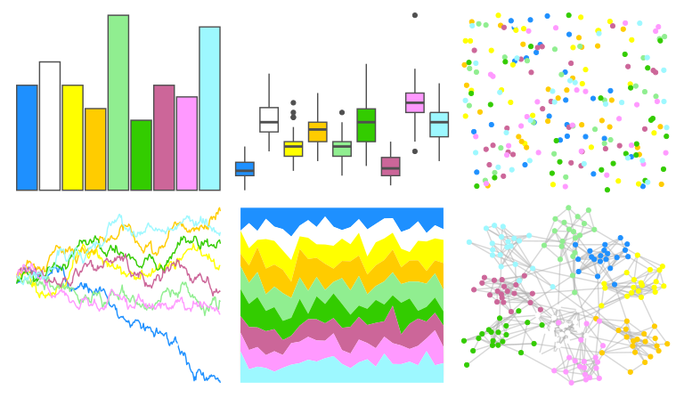

# ggprism - spring2 

::: columns
::: {.column width="50%"}

**Github**

[csdaw/ggprism](https://github.com/csdaw/ggprism)
:::

::: {.column width="50%"}

**CRAN**

[ggprism](https://CRAN.R-project.org/package=ggprism)
:::
:::

<hr> 

Use with [paletteer](https://emilhvitfeldt.github.io/paletteer/) package:

```r
library(paletteer)
paletteer_d("ggprism::spring2")
```

Use raw:

```r
c("#1E90FFFF", "#FFFFFFFF", "#FFFF00FF", "#FFCC00FF", "#90EE90FF", "#33CC00FF", "#CC6699FF", "#FF99FFFF", "#9DF8FFFF")
``` 

 

<br>

# Related Palettes

<div class="list" style="display: grid; grid-template-columns: auto auto auto;"> <figure class="figure">
<a href="../../awtools/a_palette/"> </a>
</figure> <figure class="figure">
<a href="../../RColorBrewer/PiYG/"> </a>
</figure> <figure class="figure">
<a href="../../fishualize/Forcipiger_longirostris/"> </a>
</figure> <figure class="figure">
<a href="../../basetheme/clean/"> </a>
</figure> <figure class="figure">
<a href="../../basetheme/minimal/"> </a>
</figure> <figure class="figure">
<a href="../../basetheme/void/"> </a>
</figure> <figure class="figure">
<a href="../../RColorBrewer/Set3/"> </a>
</figure> <figure class="figure">
<a href="../../tvthemes/rickAndMorty/"> </a>
</figure> <figure class="figure">
<a href="../../palettetown/ivysaur/"> </a>
</figure> <figure class="figure">
<a href="../../tvthemes/Opal/"> </a>
</figure> <figure class="figure">
<a href="../../khroma/light/"> </a>
</figure> <figure class="figure">
<a href="../../rcartocolor/Pastel/"> </a>
</figure> 
</div>
