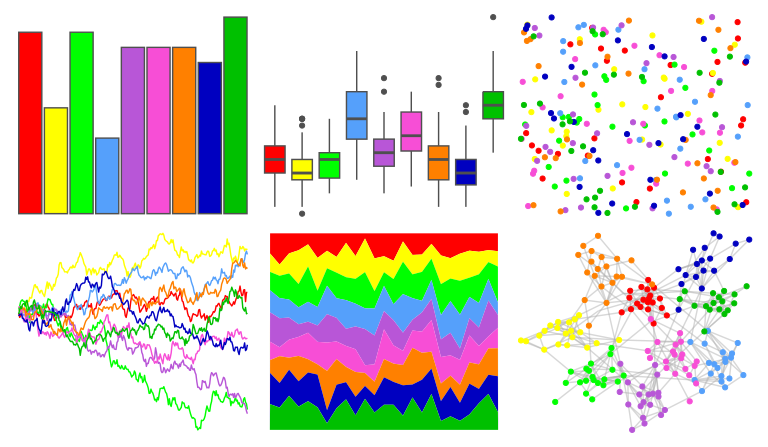

# ggprism - stained_glass 

::: columns
::: {.column width="50%"}

**Github**

[csdaw/ggprism](https://github.com/csdaw/ggprism)
:::

::: {.column width="50%"}

**CRAN**

[ggprism](https://CRAN.R-project.org/package=ggprism)
:::
:::

<hr> 

Use with [paletteer](https://emilhvitfeldt.github.io/paletteer/) package:

```r
library(paletteer)
paletteer_d("ggprism::stained_glass")
```

Use raw:

```r
c("#FF0000FF", "#FFFF00FF", "#00FF00FF", "#55A0FBFF", "#B856D7FF", "#F74ED6FF", "#FF8000FF", "#0000C0FF", "#00C000FF")
``` 

 

<br>

# Related Palettes

<div class="list" style="display: grid; grid-template-columns: auto auto auto;"> <figure class="figure">
<a href="../../awtools/a_palette/"> </a>
</figure> <figure class="figure">
<a href="../../ggprism/stained_glass2/"> </a>
</figure> <figure class="figure">
<a href="../../jcolors/pal3/"> </a>
</figure> <figure class="figure">
<a href="../../ggthemes/stata_s1rcolor/"> </a>
</figure> <figure class="figure">
<a href="../../jcolors/rainbow/"> </a>
</figure> <figure class="figure">
<a href="../../Redmonder/qMSOStd/"> </a>
</figure> <figure class="figure">
<a href="../../basetheme/deepblue/"> </a>
</figure> <figure class="figure">
<a href="../../yarrr/basel/"> </a>
</figure> <figure class="figure">
<a href="../../basetheme/ink/"> </a>
</figure> <figure class="figure">
<a href="../../tidyquant/tq_dark/"> </a>
</figure> <figure class="figure">
<a href="../../ggthemes/gdoc/"> </a>
</figure> <figure class="figure">
<a href="../../RSkittleBrewer/smarties/"> </a>
</figure> 
</div>
