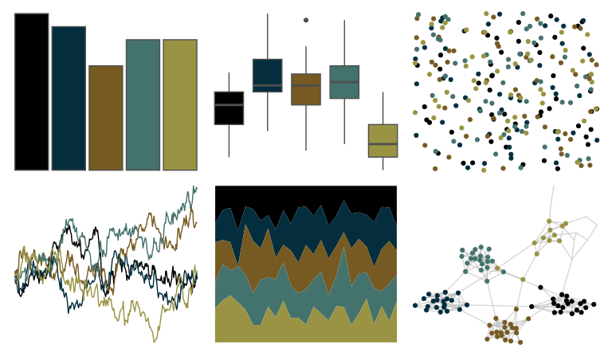

# ggprism - starry 

::: columns
::: {.column width="50%"}

**Github**

[csdaw/ggprism](https://github.com/csdaw/ggprism)
:::

::: {.column width="50%"}

**CRAN**

[ggprism](https://CRAN.R-project.org/package=ggprism)
:::
:::

<hr> 

Use with [paletteer](https://emilhvitfeldt.github.io/paletteer/) package:

```r
library(paletteer)
paletteer_d("ggprism::starry")
```

Use raw:

```r
c("#000000FF", "#042E3DFF", "#765A22FF", "#44726DFF", "#9A9343FF")
``` 

 

<br>

# Related Palettes

<div class="list" style="display: grid; grid-template-columns: auto auto auto;"> <figure class="figure">
<a href="../../awtools/a_palette/"> </a>
</figure> <figure class="figure">
<a href="../../lisa/JanvanEyck/"> </a>
</figure> <figure class="figure">
<a href="../../Manu/Korimako/"> </a>
</figure> <figure class="figure">
<a href="../../trekcolors/enara2/"> </a>
</figure> <figure class="figure">
<a href="../../ggthemes/wsj_black_green/"> </a>
</figure> <figure class="figure">
<a href="../../MetBrewer/Veronese/"> </a>
</figure> <figure class="figure">
<a href="../../MetBrewer/Nattier/"> </a>
</figure> <figure class="figure">
<a href="../../nbapalettes/lakers_city/"> </a>
</figure> <figure class="figure">
<a href="../../Manu/Pepetuna/"> </a>
</figure> <figure class="figure">
<a href="../../ghibli/YesterdayDark/"> </a>
</figure> <figure class="figure">
<a href="../../rtist/vermeer/"> </a>
</figure> <figure class="figure">
<a href="../../ggprism/pearl/"> </a>
</figure> 
</div>
