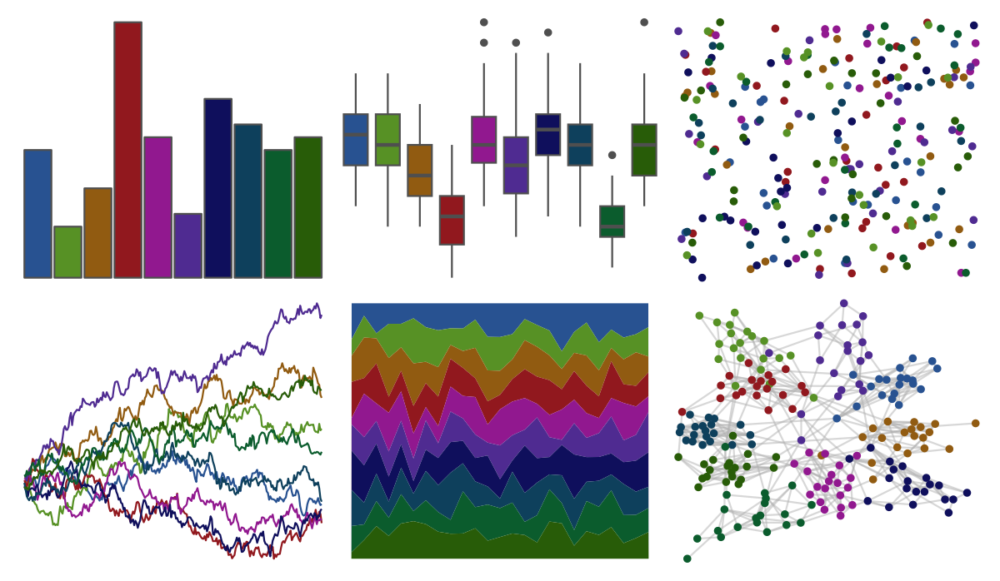

# ggprism - summer 

::: columns
::: {.column width="50%"}

**Github**

[csdaw/ggprism](https://github.com/csdaw/ggprism)
:::

::: {.column width="50%"}

**CRAN**

[ggprism](https://CRAN.R-project.org/package=ggprism)
:::
:::

<hr> 

Use with [paletteer](https://emilhvitfeldt.github.io/paletteer/) package:

```r
library(paletteer)
paletteer_d("ggprism::summer")
```

Use raw:

```r
c("#285291FF", "#579125FF", "#915B11FF", "#91181EFF", "#91188FFF", "#4F2B91FF", "#0F0F5CFF", "#0E405CFF", "#0B5C2DFF", "#285C08FF")
``` 

 

<br>

# Related Palettes

<div class="list" style="display: grid; grid-template-columns: auto auto auto;"> <figure class="figure">
<a href="../../awtools/a_palette/"> </a>
</figure> <figure class="figure">
<a href="../../ButterflyColors/hamadryas_feronia/"> </a>
</figure> <figure class="figure">
<a href="../../ButterflyColors/hamadryas_feronia/"> </a>
</figure> <figure class="figure">
<a href="../../ggprism/muted_rainbow/"> </a>
</figure> <figure class="figure">
<a href="../../peRReo/eminem/"> </a>
</figure> <figure class="figure">
<a href="../../PrettyCols/Dark/"> </a>
</figure> <figure class="figure">
<a href="../../ggprism/floral/"> </a>
</figure> <figure class="figure">
<a href="../../MexBrewer/Casita3/"> </a>
</figure> <figure class="figure">
<a href="../../MetBrewer/Ingres/"> </a>
</figure> <figure class="figure">
<a href="../../ggsci/default_aaas/"> </a>
</figure> <figure class="figure">
<a href="../../Manu/Korimako/"> </a>
</figure> <figure class="figure">
<a href="../../nbapalettes/nuggets_statement/"> </a>
</figure> 
</div>
