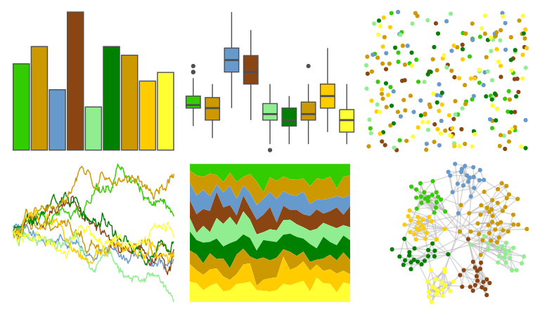

# ggprism - sunny_garden2 

::: columns
::: {.column width="50%"}

**Github**

[csdaw/ggprism](https://github.com/csdaw/ggprism)
:::

::: {.column width="50%"}

**CRAN**

[ggprism](https://CRAN.R-project.org/package=ggprism)
:::
:::

<hr> 

Use with [paletteer](https://emilhvitfeldt.github.io/paletteer/) package:

```r
library(paletteer)
paletteer_d("ggprism::sunny_garden2")
```

Use raw:

```r
c("#33CC00FF", "#CC9900FF", "#6699CCFF", "#8B4513FF", "#90EE90FF", "#008000FF", "#CC9900FF", "#FFCC00FF", "#FFFF33FF")
``` 

 

<br>

# Related Palettes

<div class="list" style="display: grid; grid-template-columns: auto auto auto;"> <figure class="figure">
<a href="../../awtools/a_palette/"> </a>
</figure> <figure class="figure">
<a href="../../ggprism/sunny_garden/"> </a>
</figure> <figure class="figure">
<a href="../../ggprism/sunny_garden3/"> </a>
</figure> <figure class="figure">
<a href="../../tvthemes/Tyrell/"> </a>
</figure> <figure class="figure">
<a href="../../palettetown/hoppip/"> </a>
</figure> <figure class="figure">
<a href="../../RColorBrewer/RdYlGn/"> </a>
</figure> <figure class="figure">
<a href="../../palettetown/sunflora/"> </a>
</figure> <figure class="figure">
<a href="../../ggthemes/Green_Orange_Teal/"> </a>
</figure> <figure class="figure">
<a href="../../palettetown/chikorita/"> </a>
</figure> <figure class="figure">
<a href="../../palettetown/skiploom/"> </a>
</figure> <figure class="figure">
<a href="../../ggthemes/Traffic/"> </a>
</figure> <figure class="figure">
<a href="../../palettetown/bayleef/"> </a>
</figure> 
</div>
