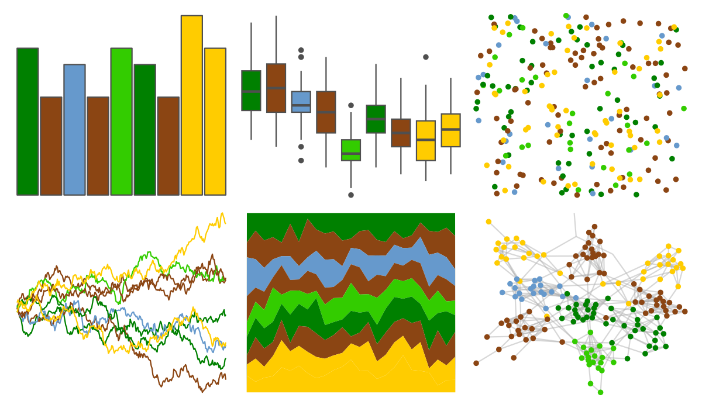

# ggprism - sunny_garden3 

::: columns
::: {.column width="50%"}

**Github**

[csdaw/ggprism](https://github.com/csdaw/ggprism)
:::

::: {.column width="50%"}

**CRAN**

[ggprism](https://CRAN.R-project.org/package=ggprism)
:::
:::

<hr> 

Use with [paletteer](https://emilhvitfeldt.github.io/paletteer/) package:

```r
library(paletteer)
paletteer_d("ggprism::sunny_garden3")
```

Use raw:

```r
c("#008000FF", "#8B4513FF", "#6699CCFF", "#8B4513FF", "#33CC00FF", "#008000FF", "#8B4513FF", "#FFCC00FF", "#FFCC00FF")
``` 

 

<br>

# Related Palettes

<div class="list" style="display: grid; grid-template-columns: auto auto auto;"> <figure class="figure">
<a href="../../amerika/Dem_Ind_Rep3/"> </a>
</figure> <figure class="figure">
<a href="../../ggprism/sunny_garden/"> </a>
</figure> <figure class="figure">
<a href="../../ggprism/sunny_garden2/"> </a>
</figure> <figure class="figure">
<a href="../../palettetown/hoppip/"> </a>
</figure> <figure class="figure">
<a href="../../ggthemes/Traffic/"> </a>
</figure> <figure class="figure">
<a href="../../RColorBrewer/RdYlGn/"> </a>
</figure> <figure class="figure">
<a href="../../nbapalettes/bucks_city2/"> </a>
</figure> <figure class="figure">
<a href="../../ggthemes/Classic_Traffic_Light/"> </a>
</figure> <figure class="figure">
<a href="../../wesanderson/Cavalcanti1/"> </a>
</figure> <figure class="figure">
<a href="../../tvthemes/Tyrell/"> </a>
</figure> <figure class="figure">
<a href="../../colRoz/k_scurra/"> </a>
</figure> <figure class="figure">
<a href="../../ochRe/lorikeet/"> </a>
</figure> 
</div>
