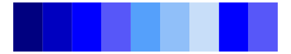
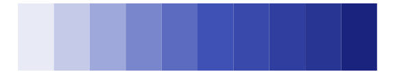
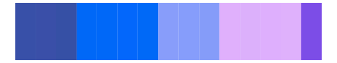

# ggprism - the_blues 

::: columns
::: {.column width="50%"}

**Github**

[csdaw/ggprism](https://github.com/csdaw/ggprism)
:::

::: {.column width="50%"}

**CRAN**

[ggprism](https://CRAN.R-project.org/package=ggprism)
:::
:::

<hr> 

Use with [paletteer](https://emilhvitfeldt.github.io/paletteer/) package:

```r
library(paletteer)
paletteer_d("ggprism::the_blues")
```

Use raw:

```r
c("#000080FF", "#0000C0FF", "#0000FFFF", "#5757F9FF", "#55A0FBFF", "#90BFF9FF", "#C8DEF9FF", "#0000FFFF", "#5757F9FF")
``` 

 

<br>

# Related Palettes

<div class="list" style="display: grid; grid-template-columns: auto auto auto;"> <figure class="figure">
<a href="../../awtools/a_palette/"> </a>
</figure> <figure class="figure">
<a href="../../ggsci/deep_purple_material/"> </a>
</figure> <figure class="figure">
<a href="../../tvthemes/Sugilite/"> </a>
</figure> <figure class="figure">
<a href="../../ggprism/winter_bright/"> </a>
</figure> <figure class="figure">
<a href="../../ggsci/indigo_material/"> </a>
</figure> <figure class="figure">
<a href="../../tvthemes/Flourite/"> </a>
</figure> <figure class="figure">
<a href="../../ggsci/purple_material/"> </a>
</figure> <figure class="figure">
<a href="../../lisa/HansHofmann/"> </a>
</figure> <figure class="figure">
<a href="../../fishualize/Acanthurus_chirurgus/"> </a>
</figure> <figure class="figure">
<a href="../../beyonce/X111/"> </a>
</figure> <figure class="figure">
<a href="../../ggsci/blue_material/"> </a>
</figure> <figure class="figure">
<a href="../../Redmonder/qMSOPu2/"> </a>
</figure> 
</div>
