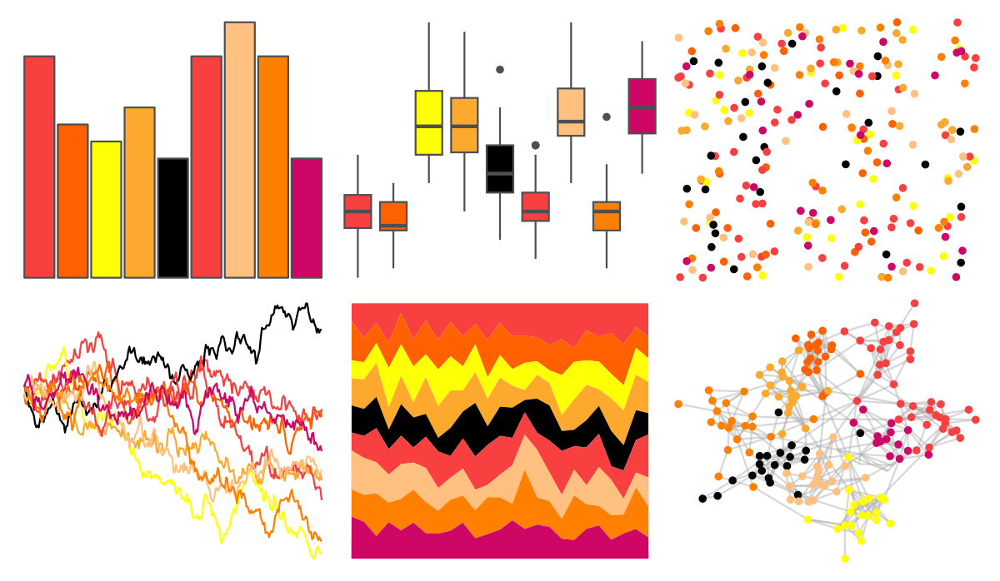
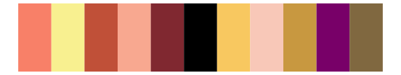

# ggprism - warm_and_sunny 

::: columns
::: {.column width="50%"}

**Github**

[csdaw/ggprism](https://github.com/csdaw/ggprism)
:::

::: {.column width="50%"}

**CRAN**

[ggprism](https://CRAN.R-project.org/package=ggprism)
:::
:::

<hr> 

Use with [paletteer](https://emilhvitfeldt.github.io/paletteer/) package:

```r
library(paletteer)
paletteer_d("ggprism::warm_and_sunny")
```

Use raw:

```r
c("#F94040FF", "#FF6000FF", "#FFFF06FF", "#FCA92EFF", "#000000FF", "#F94040FF", "#FFC080FF", "#FF8000FF", "#CE0665FF")
``` 

 

<br>

# Related Palettes

<div class="list" style="display: grid; grid-template-columns: auto auto auto;"> <figure class="figure">
<a href="../../amerika/Dem_Ind_Rep3/"> </a>
</figure> <figure class="figure">
<a href="../../palettetown/skitty/"> </a>
</figure> <figure class="figure">
<a href="../../palettetown/lileep/"> </a>
</figure> <figure class="figure">
<a href="../../tvthemes/Stannis/"> </a>
</figure> <figure class="figure">
<a href="../../palettetown/banette/"> </a>
</figure> <figure class="figure">
<a href="../../palettetown/parasect/"> </a>
</figure> <figure class="figure">
<a href="../../palettetown/blaziken/"> </a>
</figure> <figure class="figure">
<a href="../../palettetown/makuhita/"> </a>
</figure> <figure class="figure">
<a href="../../palettetown/smoochum/"> </a>
</figure> <figure class="figure">
<a href="../../palettetown/ampharos/"> </a>
</figure> <figure class="figure">
<a href="../../MoMAColors/Exter/"> </a>
</figure> <figure class="figure">
<a href="../../palettetown/sentret/"> </a>
</figure> 
</div>
