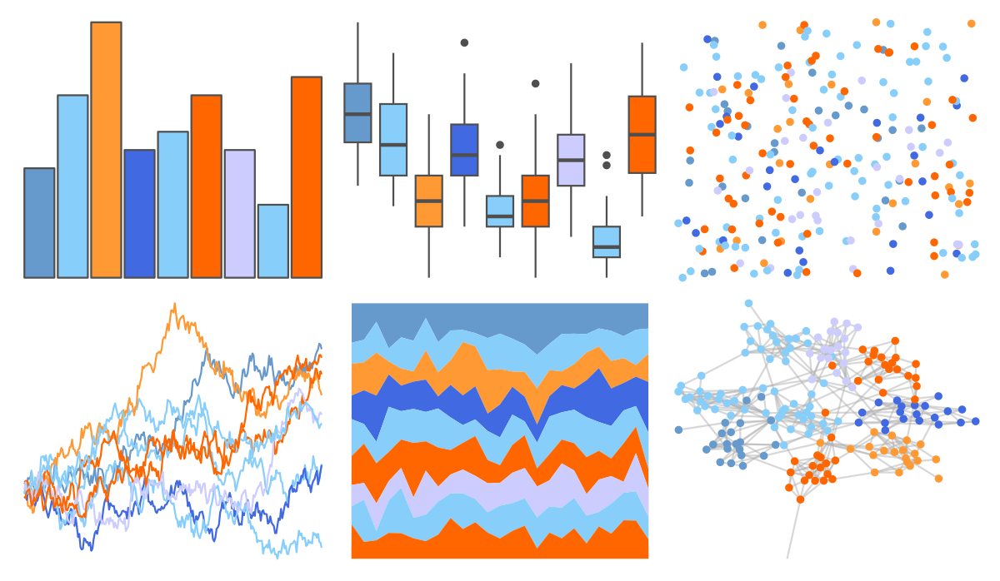
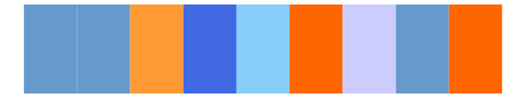
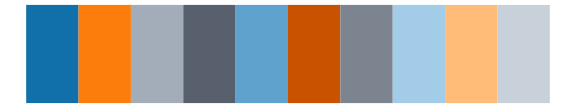

# ggprism - wool_muffler3 

::: columns
::: {.column width="50%"}

**Github**

[csdaw/ggprism](https://github.com/csdaw/ggprism)
:::

::: {.column width="50%"}

**CRAN**

[ggprism](https://CRAN.R-project.org/package=ggprism)
:::
:::

<hr> 

Use with [paletteer](https://emilhvitfeldt.github.io/paletteer/) package:

```r
library(paletteer)
paletteer_d("ggprism::wool_muffler3")
```

Use raw:

```r
c("#6699CCFF", "#87CEFAFF", "#FF9933FF", "#4169E1FF", "#87CEFAFF", "#FF6600FF", "#CCCCFFFF", "#87CEFAFF", "#FF6600FF")
``` 

 

<br>

# Related Palettes

<div class="list" style="display: grid; grid-template-columns: auto auto auto;"> <figure class="figure">
<a href="../../amerika/Dem_Ind_Rep3/"> </a>
</figure> <figure class="figure">
<a href="../../ggprism/wool_muffler/"> </a>
</figure> <figure class="figure">
<a href="../../ggprism/wool_muffler2/"> </a>
</figure> <figure class="figure">
<a href="../../calecopal/figmtn/"> </a>
</figure> <figure class="figure">
<a href="../../ggthemes/Classic_Blue_Red_12/"> </a>
</figure> <figure class="figure">
<a href="../../ggthemes/Color_Blind/"> </a>
</figure> <figure class="figure">
<a href="../../MetBrewer/Hiroshige/"> </a>
</figure> <figure class="figure">
<a href="../../khroma/sunset/"> </a>
</figure> <figure class="figure">
<a href="../../MetBrewer/OKeeffe1/"> </a>
</figure> <figure class="figure">
<a href="../../khroma/BuRd/"> </a>
</figure> <figure class="figure">
<a href="../../tvthemes/Day/"> </a>
</figure> <figure class="figure">
<a href="../../palettetown/mudkip/"> </a>
</figure> 
</div>
