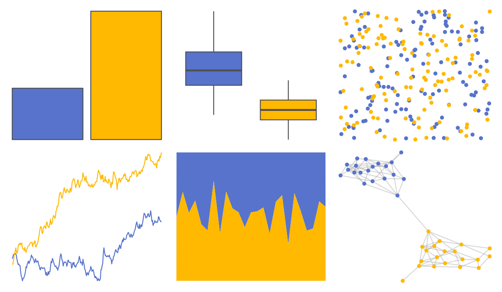

# ggsci - alternating_igv 

::: columns
::: {.column width="50%"}

**Github**

[nanxstats/ggsci](https://github.com/nanxstats/ggsci)
:::

::: {.column width="50%"}

**CRAN**

[ggsci](https://CRAN.R-project.org/package=ggsci)
:::
:::

<hr> 

Use with [paletteer](https://emilhvitfeldt.github.io/paletteer/) package:

```r
library(paletteer)
paletteer_d("ggsci::alternating_igv")
```

Use raw:

```r
c("#5773CCFF", "#FFB900FF")
``` 

 

<br>

# Related Palettes

<div class="list" style="display: grid; grid-template-columns: auto auto auto;"> <figure class="figure">
<a href="../../awtools/a_palette/"> </a>
</figure> <figure class="figure">
<a href="../../ButterflyColors/hamadryas_feronia/"> </a>
</figure> <figure class="figure">
<a href="../../ButterflyColors/hamadryas_feronia/"> </a>
</figure> <figure class="figure">
<a href="../../nbapalettes/pacers_classic/"> </a>
</figure> <figure class="figure">
<a href="../../khroma/highcontrast/"> </a>
</figure> <figure class="figure">
<a href="../../ggthemes/wsj_red_green/"> </a>
</figure> <figure class="figure">
<a href="../../futurevisions/atomic_red/"> </a>
</figure> <figure class="figure">
<a href="../../nbapalettes/warriors_cny/"> </a>
</figure> <figure class="figure">
<a href="../../nbapalettes/pacers/"> </a>
</figure> <figure class="figure">
<a href="../../nbapalettes/huskies/"> </a>
</figure> <figure class="figure">
<a href="../../ltc/trio4/"> </a>
</figure> <figure class="figure">
<a href="../../nbapalettes/bulls_city/"> </a>
</figure> 
</div>
