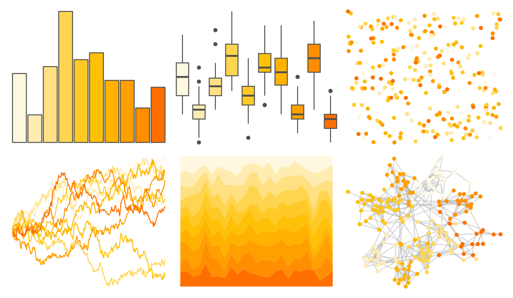
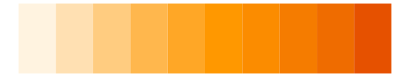
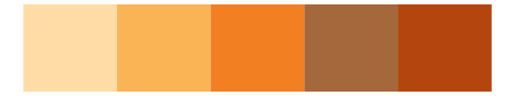

# ggsci - amber_material 

::: columns
::: {.column width="50%"}

**Github**

[nanxstats/ggsci](https://github.com/nanxstats/ggsci)
:::

::: {.column width="50%"}

**CRAN**

[ggsci](https://CRAN.R-project.org/package=ggsci)
:::
:::

<hr> 

Use with [paletteer](https://emilhvitfeldt.github.io/paletteer/) package:

```r
library(paletteer)
paletteer_d("ggsci::amber_material")
```

Use raw:

```r
c("#FFF8E1FF", "#FFECB3FF", "#FFE082FF", "#FFD54FFF", "#FFCA28FF", "#FFC107FF", "#FFB300FF", "#FFA000FF", "#FF8F00FF", "#FF6F00FF")
``` 

 

<br>

# Related Palettes

<div class="list" style="display: grid; grid-template-columns: auto auto auto;"> <figure class="figure">
<a href="../../awtools/a_palette/"> </a>
</figure> <figure class="figure">
<a href="../../ggsci/yellow_material/"> </a>
</figure> <figure class="figure">
<a href="../../ggsci/orange_material/"> </a>
</figure> <figure class="figure">
<a href="../../ggprism/flames/"> </a>
</figure> <figure class="figure">
<a href="../../ggprism/flames2/"> </a>
</figure> <figure class="figure">
<a href="../../fishualize/Cephalopholis_fulva/"> </a>
</figure> <figure class="figure">
<a href="../../colRoz/c_kingii/"> </a>
</figure> <figure class="figure">
<a href="../../fishualize/Chormis_multilineata/"> </a>
</figure> <figure class="figure">
<a href="../../khroma/YlOrBr/"> </a>
</figure> <figure class="figure">
<a href="../../RColorBrewer/YlOrBr/"> </a>
</figure> <figure class="figure">
<a href="../../ggprism/mustard_field2/"> </a>
</figure> <figure class="figure">
<a href="../../calecopal/canary/"> </a>
</figure> 
</div>
