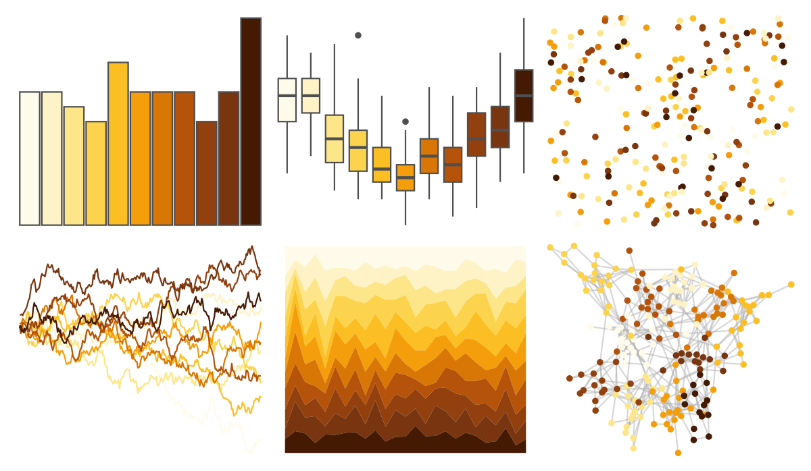

# ggsci - amber_tw3 

::: columns
::: {.column width="50%"}

**Github**

[nanxstats/ggsci](https://github.com/nanxstats/ggsci)
:::

::: {.column width="50%"}

**CRAN**

[ggsci](https://CRAN.R-project.org/package=ggsci)
:::
:::

<hr> 

Use with [paletteer](https://emilhvitfeldt.github.io/paletteer/) package:

```r
library(paletteer)
paletteer_d("ggsci::amber_tw3")
```

Use raw:

```r
c("#FFFBEBFF", "#FEF3C7FF", "#FDE68AFF", "#FCD34DFF", "#FBBF24FF", "#F59E0BFF", "#D97706FF", "#B45309FF", "#92400EFF", "#78350FFF", "#451A03FF")
``` 

 

<br>

# Related Palettes

<div class="list" style="display: grid; grid-template-columns: auto auto auto;"> <figure class="figure">
<a href="../../amerika/Dem_Ind_Rep3/"> </a>
</figure> <figure class="figure">
<a href="../../khroma/YlOrBr/"> </a>
</figure> <figure class="figure">
<a href="../../RColorBrewer/YlOrBr/"> </a>
</figure> <figure class="figure">
<a href="../../ggsci/yellow_tw3/"> </a>
</figure> <figure class="figure">
<a href="../../ggsci/orange_tw3/"> </a>
</figure> <figure class="figure">
<a href="../../werpals/halong/"> </a>
</figure> <figure class="figure">
<a href="../../beyonce/X59/"> </a>
</figure> <figure class="figure">
<a href="../../RColorBrewer/YlOrRd/"> </a>
</figure> <figure class="figure">
<a href="../../ggsci/orange_bs5/"> </a>
</figure> <figure class="figure">
<a href="../../beyonce/X86/"> </a>
</figure> <figure class="figure">
<a href="../../RColorBrewer/Oranges/"> </a>
</figure> <figure class="figure">
<a href="../../khroma/incandescent/"> </a>
</figure> 
</div>
