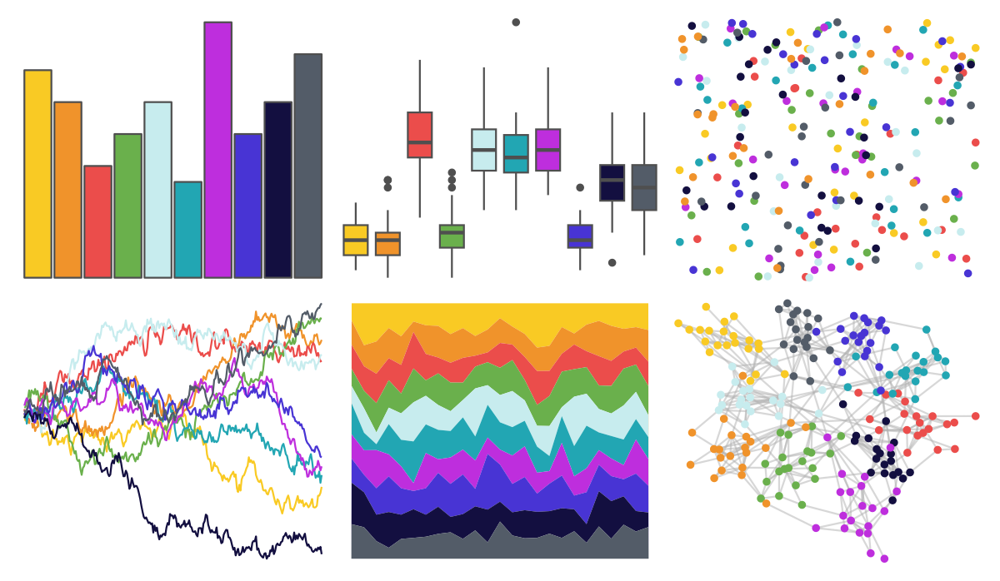

# ggsci - aussie_flatui 

::: columns
::: {.column width="50%"}

**Github**

[nanxstats/ggsci](https://github.com/nanxstats/ggsci)
:::

::: {.column width="50%"}

**CRAN**

[ggsci](https://CRAN.R-project.org/package=ggsci)
:::
:::

<hr> 

Use with [paletteer](https://emilhvitfeldt.github.io/paletteer/) package:

```r
library(paletteer)
paletteer_d("ggsci::aussie_flatui")
```

Use raw:

```r
c("#F9CA24FF", "#F0932BFF", "#EB4D4BFF", "#6AB04CFF", "#C7ECEEFF", "#22A6B3FF", "#BE2EDDFF", "#4834D4FF", "#130F40FF", "#535C68FF")
``` 

 

<br>

# Related Palettes

<div class="list" style="display: grid; grid-template-columns: auto auto auto;"> <figure class="figure">
<a href="../../awtools/a_palette/"> </a>
</figure> <figure class="figure">
<a href="../../ButterflyColors/hamadryas_feronia/"> </a>
</figure> <figure class="figure">
<a href="../../ButterflyColors/hamadryas_feronia/"> </a>
</figure> <figure class="figure">
<a href="../../tidyquant/tq_green/"> </a>
</figure> <figure class="figure">
<a href="../../awtools/ppalette/"> </a>
</figure> <figure class="figure">
<a href="../../jcolors/pal6/"> </a>
</figure> <figure class="figure">
<a href="../../ggsci/lanonc_lancet/"> </a>
</figure> <figure class="figure">
<a href="../../rcartocolor/Bold/"> </a>
</figure> <figure class="figure">
<a href="../../rcartocolor/Vivid/"> </a>
</figure> <figure class="figure">
<a href="../../rcartocolor/Safe/"> </a>
</figure> <figure class="figure">
<a href="../../palettetown/ariados/"> </a>
</figure> <figure class="figure">
<a href="../../peRReo/karolg/"> </a>
</figure> 
</div>
