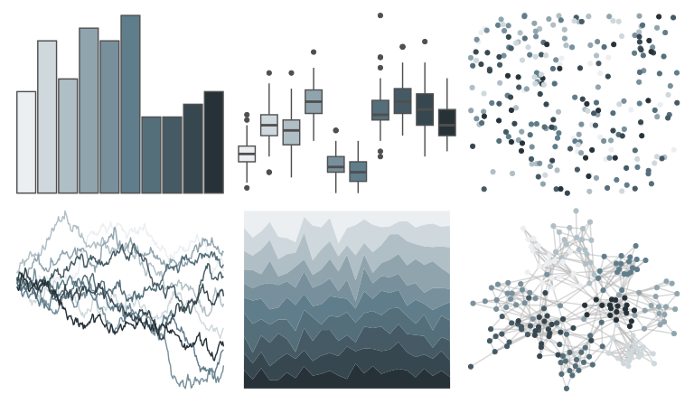

# ggsci - blue_grey_material 

::: columns
::: {.column width="50%"}

**Github**

[nanxstats/ggsci](https://github.com/nanxstats/ggsci)
:::

::: {.column width="50%"}

**CRAN**

[ggsci](https://CRAN.R-project.org/package=ggsci)
:::
:::

<hr> 

Use with [paletteer](https://emilhvitfeldt.github.io/paletteer/) package:

```r
library(paletteer)
paletteer_d("ggsci::blue_grey_material")
```

Use raw:

```r
c("#ECEFF1FF", "#CFD8DCFF", "#B0BEC5FF", "#90A4AEFF", "#78909CFF", "#607D8BFF", "#546E7AFF", "#455A64FF", "#37474FFF", "#263238FF")
``` 

 

<br>

# Related Palettes

<div class="list" style="display: grid; grid-template-columns: auto auto auto;"> <figure class="figure">
<a href="../../awtools/a_palette/"> </a>
</figure> <figure class="figure">
<a href="../../Redmonder/qMSOPu/"> </a>
</figure> <figure class="figure">
<a href="../../severance/Half/"> </a>
</figure> <figure class="figure">
<a href="../../ochRe/dead_reef/"> </a>
</figure> <figure class="figure">
<a href="../../Redmonder/sPBIGy1/"> </a>
</figure> <figure class="figure">
<a href="../../Redmonder/sPBIGy2/"> </a>
</figure> <figure class="figure">
<a href="../../PNWColors/Winter/"> </a>
</figure> <figure class="figure">
<a href="../../trekcolors/andorian/"> </a>
</figure> <figure class="figure">
<a href="../../palettetown/grimer/"> </a>
</figure> <figure class="figure">
<a href="../../musculusColors/ErMole/"> </a>
</figure> <figure class="figure">
<a href="../../palettetown/muk/"> </a>
</figure> <figure class="figure">
<a href="../../musculusColors/ErWhale/"> </a>
</figure> 
</div>
