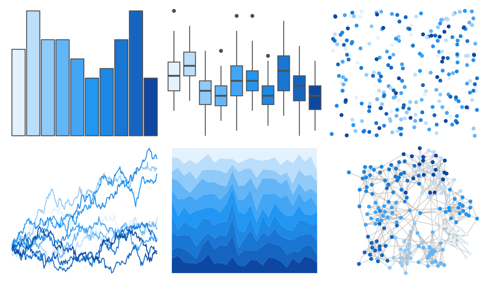
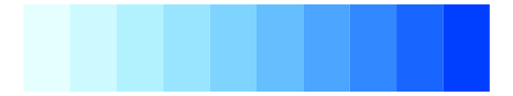
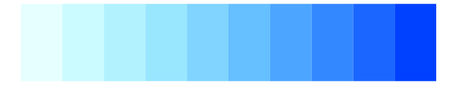

# ggsci - blue_material 

::: columns
::: {.column width="50%"}

**Github**

[nanxstats/ggsci](https://github.com/nanxstats/ggsci)
:::

::: {.column width="50%"}

**CRAN**

[ggsci](https://CRAN.R-project.org/package=ggsci)
:::
:::

<hr> 

Use with [paletteer](https://emilhvitfeldt.github.io/paletteer/) package:

```r
library(paletteer)
paletteer_d("ggsci::blue_material")
```

Use raw:

```r
c("#E3F2FDFF", "#BBDEFBFF", "#90CAF9FF", "#64B5F6FF", "#42A5F5FF", "#2196F3FF", "#1E88E5FF", "#1976D2FF", "#1565C0FF", "#0D47A1FF")
``` 

 

<br>

# Related Palettes

<div class="list" style="display: grid; grid-template-columns: auto auto auto;"> <figure class="figure">
<a href="../../amerika/Dem_Ind_Rep3/"> </a>
</figure> <figure class="figure">
<a href="../../ggsci/light_blue_material/"> </a>
</figure> <figure class="figure">
<a href="../../grDevices/blues9/"> </a>
</figure> <figure class="figure">
<a href="../../RColorBrewer/Blues/"> </a>
</figure> <figure class="figure">
<a href="../../ggsci/sky_tw3/"> </a>
</figure> <figure class="figure">
<a href="../../colorBlindness/LightBlue2DarkBlue10Steps/"> </a>
</figure> <figure class="figure">
<a href="../../dichromat/LightBluetoDarkBlue_10/"> </a>
</figure> <figure class="figure">
<a href="../../ggsci/blue_tw3/"> </a>
</figure> <figure class="figure">
<a href="../../LaCroixColoR/Pure/"> </a>
</figure> <figure class="figure">
<a href="../../ggsci/cyan_tw3/"> </a>
</figure> <figure class="figure">
<a href="../../RColorBrewer/PuBu/"> </a>
</figure> <figure class="figure">
<a href="../../colRoz/sky/"> </a>
</figure> 
</div>
