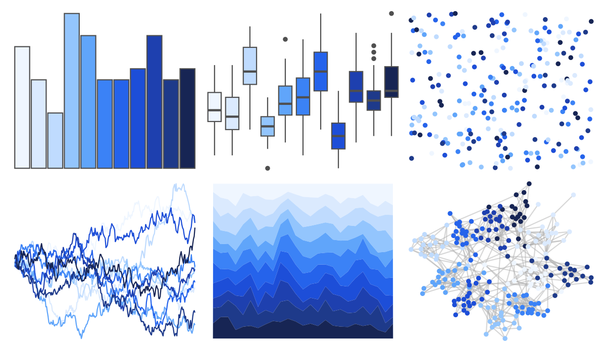

# ggsci - blue_tw3 

::: columns
::: {.column width="50%"}

**Github**

[nanxstats/ggsci](https://github.com/nanxstats/ggsci)
:::

::: {.column width="50%"}

**CRAN**

[ggsci](https://CRAN.R-project.org/package=ggsci)
:::
:::

<hr> 

Use with [paletteer](https://emilhvitfeldt.github.io/paletteer/) package:

```r
library(paletteer)
paletteer_d("ggsci::blue_tw3")
```

Use raw:

```r
c("#EFF6FFFF", "#DBEAFEFF", "#BFDBFEFF", "#93C5FDFF", "#60A5FAFF", "#3B82F6FF", "#2563EBFF", "#1D4ED8FF", "#1E40AFFF", "#1E3A8AFF", "#172554FF")
``` 

 

<br>

# Related Palettes

<div class="list" style="display: grid; grid-template-columns: auto auto auto;"> <figure class="figure">
<a href="../../amerika/Dem_Ind_Rep3/"> </a>
</figure> <figure class="figure">
<a href="../../ggsci/indigo_tw3/"> </a>
</figure> <figure class="figure">
<a href="../../ggsci/sky_tw3/"> </a>
</figure> <figure class="figure">
<a href="../../ggsci/violet_tw3/"> </a>
</figure> <figure class="figure">
<a href="../../grDevices/blues9/"> </a>
</figure> <figure class="figure">
<a href="../../RColorBrewer/Blues/"> </a>
</figure> <figure class="figure">
<a href="../../ggsci/blue_bs5/"> </a>
</figure> <figure class="figure">
<a href="../../lisa/HansHofmann/"> </a>
</figure> <figure class="figure">
<a href="../../ggsci/blue_material/"> </a>
</figure> <figure class="figure">
<a href="../../ggsci/purple_tw3/"> </a>
</figure> <figure class="figure">
<a href="../../RColorBrewer/PuBu/"> </a>
</figure> <figure class="figure">
<a href="../../RColorBrewer/BuPu/"> </a>
</figure> 
</div>
