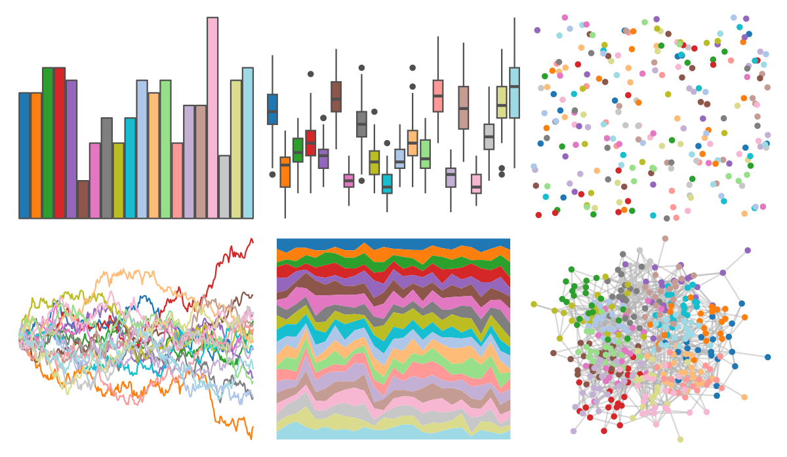

# ggsci - category20_d3 

::: columns
::: {.column width="50%"}

**Github**

[nanxstats/ggsci](https://github.com/nanxstats/ggsci)
:::

::: {.column width="50%"}

**CRAN**

[ggsci](https://CRAN.R-project.org/package=ggsci)
:::
:::

<hr> 

Use with [paletteer](https://emilhvitfeldt.github.io/paletteer/) package:

```r
library(paletteer)
paletteer_d("ggsci::category20_d3")
```

Use raw:

```r
c("#1F77B4FF", "#FF7F0EFF", "#2CA02CFF", "#D62728FF", "#9467BDFF", "#8C564BFF", "#E377C2FF", "#7F7F7FFF", "#BCBD22FF", "#17BECFFF", "#AEC7E8FF", "#FFBB78FF", "#98DF8AFF", "#FF9896FF", "#C5B0D5FF", "#C49C94FF", "#F7B6D2FF", "#C7C7C7FF", "#DBDB8DFF", "#9EDAE5FF")
``` 

 

<br>

# Related Palettes

<div class="list" style="display: grid; grid-template-columns: auto auto auto;"> <figure class="figure">
<a href="../../awtools/a_palette/"> </a>
</figure> <figure class="figure">
<a href="../../ButterflyColors/hamadryas_feronia/"> </a>
</figure> <figure class="figure">
<a href="../../ButterflyColors/hamadryas_feronia/"> </a>
</figure> <figure class="figure">
<a href="../../ggthemes/Classic_20/"> </a>
</figure> <figure class="figure">
<a href="../../ggthemes/Tableau_20/"> </a>
</figure> <figure class="figure">
<a href="../../ggsci/category20c_d3/"> </a>
</figure> <figure class="figure">
<a href="../../ggthemes/Hue_Circle/"> </a>
</figure> <figure class="figure">
<a href="../../miscpalettes/pastel/"> </a>
</figure> <figure class="figure">
<a href="../../ggthemes/stata_s2color/"> </a>
</figure> <figure class="figure">
<a href="../../palettetown/wartortle/"> </a>
</figure> <figure class="figure">
<a href="../../rcartocolor/Vivid/"> </a>
</figure> <figure class="figure">
<a href="../../IslamicArt/shiraz2/"> </a>
</figure> 
</div>
