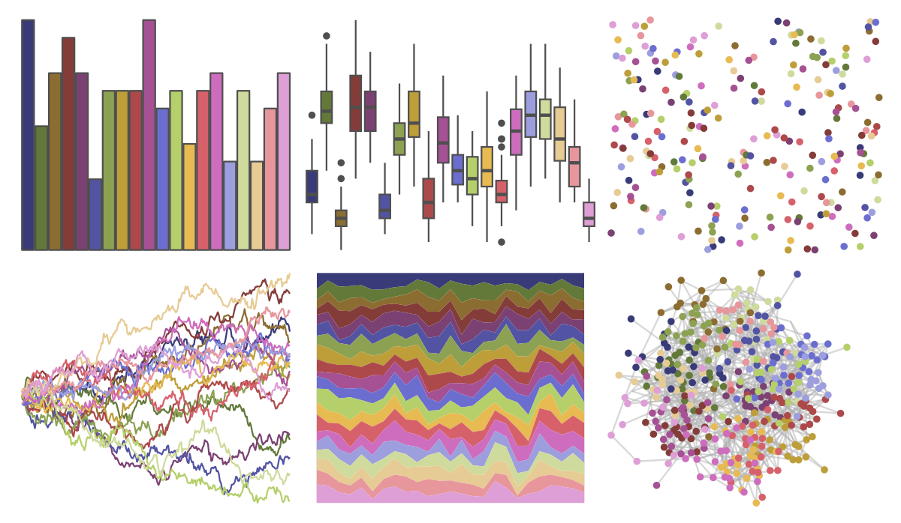

# ggsci - category20b_d3 

::: columns
::: {.column width="50%"}

**Github**

[nanxstats/ggsci](https://github.com/nanxstats/ggsci)
:::

::: {.column width="50%"}

**CRAN**

[ggsci](https://CRAN.R-project.org/package=ggsci)
:::
:::

<hr> 

Use with [paletteer](https://emilhvitfeldt.github.io/paletteer/) package:

```r
library(paletteer)
paletteer_d("ggsci::category20b_d3")
```

Use raw:

```r
c("#393B79FF", "#637939FF", "#8C6D31FF", "#843C39FF", "#7B4173FF", "#5254A3FF", "#8CA252FF", "#BD9E39FF", "#AD494AFF", "#A55194FF", "#6B6ECFFF", "#B5CF6BFF", "#E7BA52FF", "#D6616BFF", "#CE6DBDFF", "#9C9EDEFF", "#CEDB9CFF", "#E7CB94FF", "#E7969CFF", "#DE9ED6FF")
``` 

 

<br>

# Related Palettes

<div class="list" style="display: grid; grid-template-columns: auto auto auto;"> <figure class="figure">
<a href="../../awtools/a_palette/"> </a>
</figure> <figure class="figure">
<a href="../../ggthemes/manyeys/"> </a>
</figure> <figure class="figure">
<a href="../../ggthemes/Hue_Circle/"> </a>
</figure> <figure class="figure">
<a href="../../MetBrewer/Signac/"> </a>
</figure> <figure class="figure">
<a href="../../DresdenColor/paired/"> </a>
</figure> <figure class="figure">
<a href="../../ggthemes/stata_s2color/"> </a>
</figure> <figure class="figure">
<a href="../../MetBrewer/Redon/"> </a>
</figure> <figure class="figure">
<a href="../../rcartocolor/Vivid/"> </a>
</figure> <figure class="figure">
<a href="../../MetBrewer/Renoir/"> </a>
</figure> <figure class="figure">
<a href="../../palettetown/rattata/"> </a>
</figure> <figure class="figure">
<a href="../../impressionist.colors/un_dimanche_apres_midi_a_l_ile_de_la_grande_jatte/"> </a>
</figure> <figure class="figure">
<a href="../../ggthemes/Classic_Cyclic/"> </a>
</figure> 
</div>
