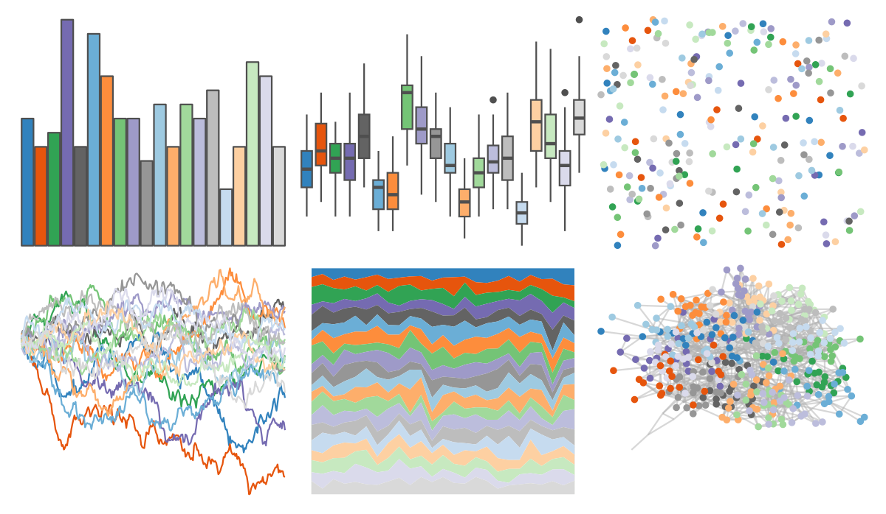

# ggsci - category20c_d3 

::: columns
::: {.column width="50%"}

**Github**

[nanxstats/ggsci](https://github.com/nanxstats/ggsci)
:::

::: {.column width="50%"}

**CRAN**

[ggsci](https://CRAN.R-project.org/package=ggsci)
:::
:::

<hr> 

Use with [paletteer](https://emilhvitfeldt.github.io/paletteer/) package:

```r
library(paletteer)
paletteer_d("ggsci::category20c_d3")
```

Use raw:

```r
c("#3182BDFF", "#E6550DFF", "#31A354FF", "#756BB1FF", "#636363FF", "#6BAED6FF", "#FD8D3CFF", "#74C476FF", "#9E9AC8FF", "#969696FF", "#9ECAE1FF", "#FDAE6BFF", "#A1D99BFF", "#BCBDDCFF", "#BDBDBDFF", "#C6DBEFFF", "#FDD0A2FF", "#C7E9C0FF", "#DADAEBFF", "#D9D9D9FF")
``` 

 

<br>

# Related Palettes

<div class="list" style="display: grid; grid-template-columns: auto auto auto;"> <figure class="figure">
<a href="../../amerika/Dem_Ind_Rep3/"> </a>
</figure> <figure class="figure">
<a href="../../ggthemes/Tableau_20/"> </a>
</figure> <figure class="figure">
<a href="../../ggsci/category20_d3/"> </a>
</figure> <figure class="figure">
<a href="../../ggthemes/Classic_20/"> </a>
</figure> <figure class="figure">
<a href="../../palettetown/kirlia/"> </a>
</figure> <figure class="figure">
<a href="../../palettetown/magnemite/"> </a>
</figure> <figure class="figure">
<a href="../../palettetown/marshtomp/"> </a>
</figure> <figure class="figure">
<a href="../../palettetown/magneton/"> </a>
</figure> <figure class="figure">
<a href="../../palettetown/mudkip/"> </a>
</figure> <figure class="figure">
<a href="../../palettetown/butterfree/"> </a>
</figure> <figure class="figure">
<a href="../../palettetown/nidoqueen/"> </a>
</figure> <figure class="figure">
<a href="../../palettetown/snorlax/"> </a>
</figure> 
</div>
