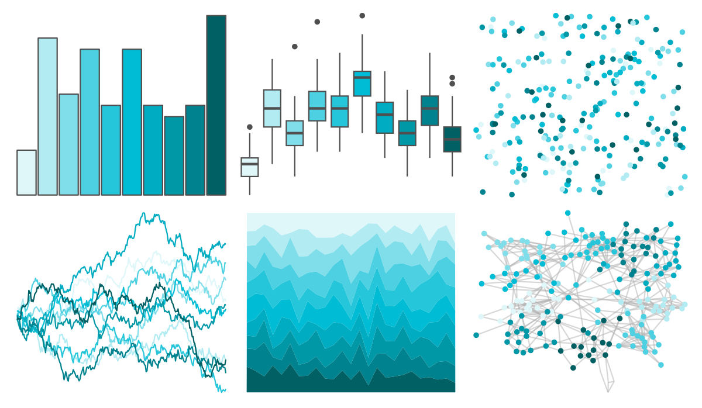

# ggsci - cyan_material 

::: columns
::: {.column width="50%"}

**Github**

[nanxstats/ggsci](https://github.com/nanxstats/ggsci)
:::

::: {.column width="50%"}

**CRAN**

[ggsci](https://CRAN.R-project.org/package=ggsci)
:::
:::

<hr> 

Use with [paletteer](https://emilhvitfeldt.github.io/paletteer/) package:

```r
library(paletteer)
paletteer_d("ggsci::cyan_material")
```

Use raw:

```r
c("#E0F7FAFF", "#B2EBF2FF", "#80DEEAFF", "#4DD0E1FF", "#26C6DAFF", "#00BCD4FF", "#00ACC1FF", "#0097A7FF", "#00838FFF", "#006064FF")
``` 

 

<br>

# Related Palettes

<div class="list" style="display: grid; grid-template-columns: auto auto auto;"> <figure class="figure">
<a href="../../amerika/Dem_Ind_Rep3/"> </a>
</figure> <figure class="figure">
<a href="../../ggsci/teal_material/"> </a>
</figure> <figure class="figure">
<a href="../../PrettyCols/Teals/"> </a>
</figure> <figure class="figure">
<a href="../../ggsci/cyan_tw3/"> </a>
</figure> <figure class="figure">
<a href="../../ggsci/light_blue_material/"> </a>
</figure> <figure class="figure">
<a href="../../ggsci/teal_tw3/"> </a>
</figure> <figure class="figure">
<a href="../../unikn/pal_seeblau/"> </a>
</figure> <figure class="figure">
<a href="../../ggsci/cyan_bs5/"> </a>
</figure> <figure class="figure">
<a href="../../miscpalettes/seaGreen/"> </a>
</figure> <figure class="figure">
<a href="../../NatParksPalettes/Glacier/"> </a>
</figure> <figure class="figure">
<a href="../../Redmonder/sPBIGn/"> </a>
</figure> <figure class="figure">
<a href="../../NineteenEightyR/youngturqs/"> </a>
</figure> 
</div>
