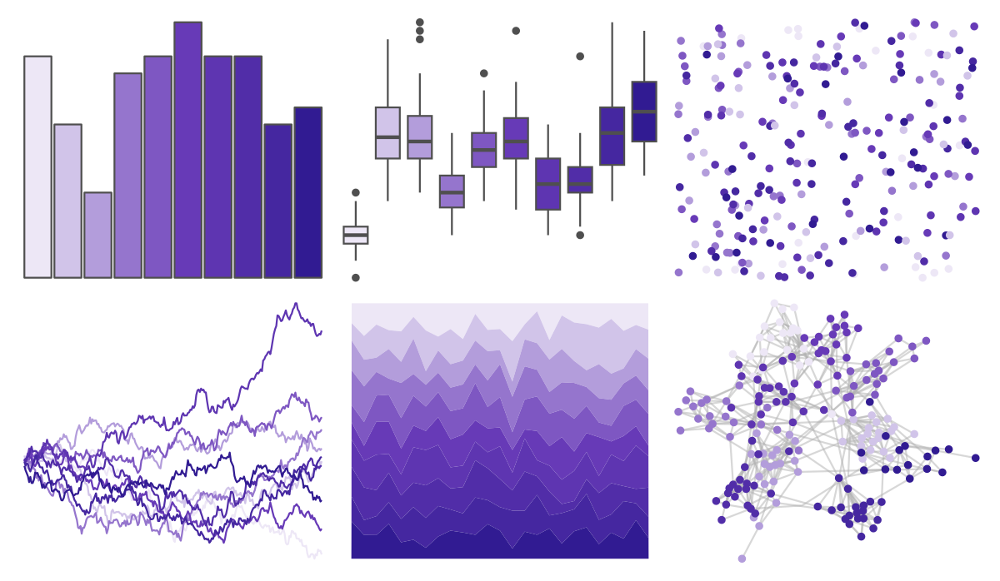

# ggsci - deep_purple_material 

::: columns
::: {.column width="50%"}

**Github**

[nanxstats/ggsci](https://github.com/nanxstats/ggsci)
:::

::: {.column width="50%"}

**CRAN**

[ggsci](https://CRAN.R-project.org/package=ggsci)
:::
:::

<hr> 

Use with [paletteer](https://emilhvitfeldt.github.io/paletteer/) package:

```r
library(paletteer)
paletteer_d("ggsci::deep_purple_material")
```

Use raw:

```r
c("#EDE7F6FF", "#D1C4E9FF", "#B39DDBFF", "#9575CDFF", "#7E57C2FF", "#673AB7FF", "#5E35B1FF", "#512DA8FF", "#4527A0FF", "#311B92FF")
``` 

 

<br>

# Related Palettes

<div class="list" style="display: grid; grid-template-columns: auto auto auto;"> <figure class="figure">
<a href="../../amerika/Dem_Ind_Rep3/"> </a>
</figure> <figure class="figure">
<a href="../../ggsci/indigo_material/"> </a>
</figure> <figure class="figure">
<a href="../../Redmonder/qMSOPu2/"> </a>
</figure> <figure class="figure">
<a href="../../ggsci/purple_material/"> </a>
</figure> <figure class="figure">
<a href="../../ggsci/purple_bs5/"> </a>
</figure> <figure class="figure">
<a href="../../ggsci/violet_tw3/"> </a>
</figure> <figure class="figure">
<a href="../../ggsci/purple_tw3/"> </a>
</figure> <figure class="figure">
<a href="../../ggsci/indigo_tw3/"> </a>
</figure> <figure class="figure">
<a href="../../rcartocolor/PurpOr/"> </a>
</figure> <figure class="figure">
<a href="../../RColorBrewer/BuPu/"> </a>
</figure> <figure class="figure">
<a href="../../RColorBrewer/Purples/"> </a>
</figure> <figure class="figure">
<a href="../../ggsci/blue_tw3/"> </a>
</figure> 
</div>
