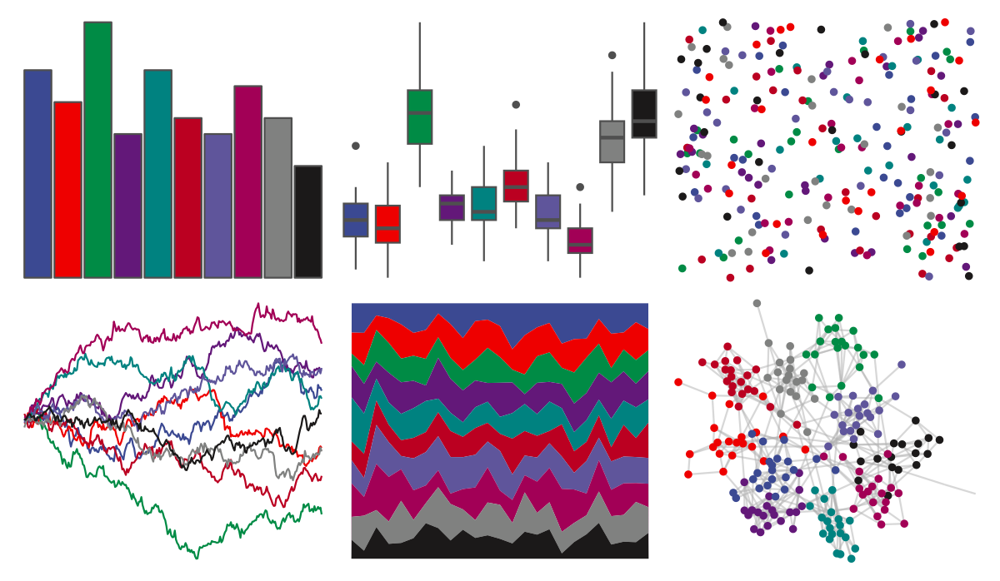

# ggsci - default_aaas 

::: columns
::: {.column width="50%"}

**Github**

[nanxstats/ggsci](https://github.com/nanxstats/ggsci)
:::

::: {.column width="50%"}

**CRAN**

[ggsci](https://CRAN.R-project.org/package=ggsci)
:::
:::

<hr> 

Use with [paletteer](https://emilhvitfeldt.github.io/paletteer/) package:

```r
library(paletteer)
paletteer_d("ggsci::default_aaas")
```

Use raw:

```r
c("#3B4992FF", "#EE0000FF", "#008B45FF", "#631879FF", "#008280FF", "#BB0021FF", "#5F559BFF", "#A20056FF", "#808180FF", "#1B1919FF")
``` 

 

<br>

# Related Palettes

<div class="list" style="display: grid; grid-template-columns: auto auto auto;"> <figure class="figure">
<a href="../../awtools/a_palette/"> </a>
</figure> <figure class="figure">
<a href="../../tvthemes/attackOnTitan/"> </a>
</figure> <figure class="figure">
<a href="../../feathers/cassowary/"> </a>
</figure> <figure class="figure">
<a href="../../ggsci/dark_uchicago/"> </a>
</figure> <figure class="figure">
<a href="../../ggsci/lanonc_lancet/"> </a>
</figure> <figure class="figure">
<a href="../../peRReo/planb/"> </a>
</figure> <figure class="figure">
<a href="../../ggsci/default_jco/"> </a>
</figure> <figure class="figure">
<a href="../../nbapalettes/suns/"> </a>
</figure> <figure class="figure">
<a href="../../ggsci/default_uchicago/"> </a>
</figure> <figure class="figure">
<a href="../../nbapalettes/bobcats/"> </a>
</figure> <figure class="figure">
<a href="../../ggthemr/grape/"> </a>
</figure> <figure class="figure">
<a href="../../ggthemr/fresh/"> </a>
</figure> 
</div>
